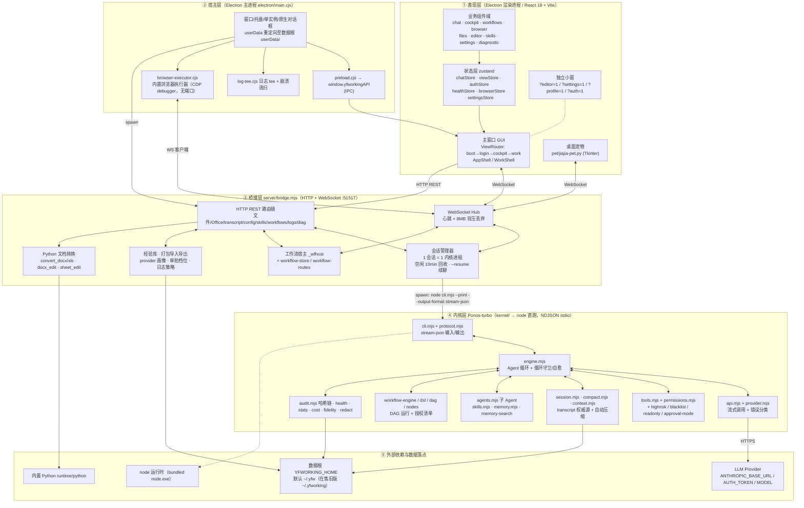
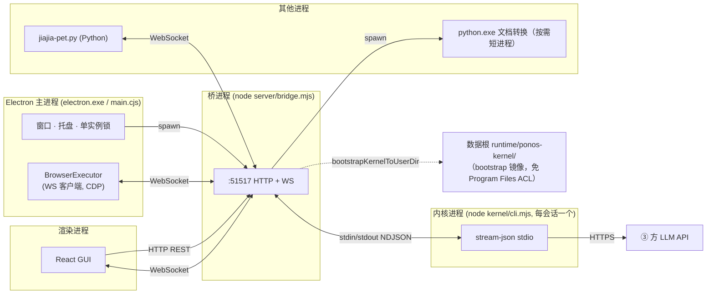
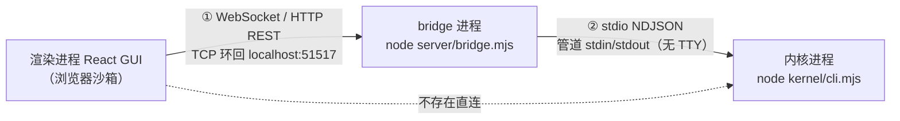
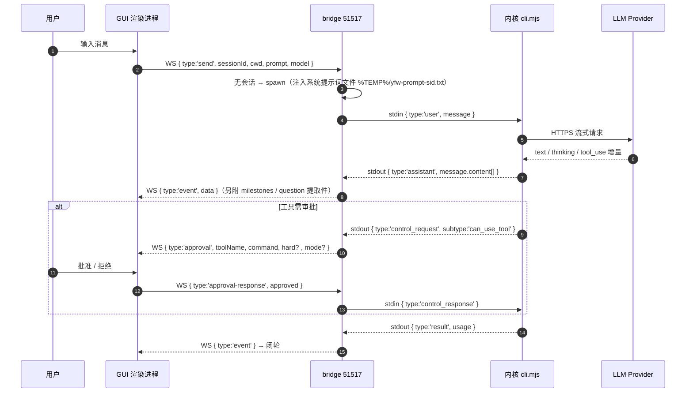
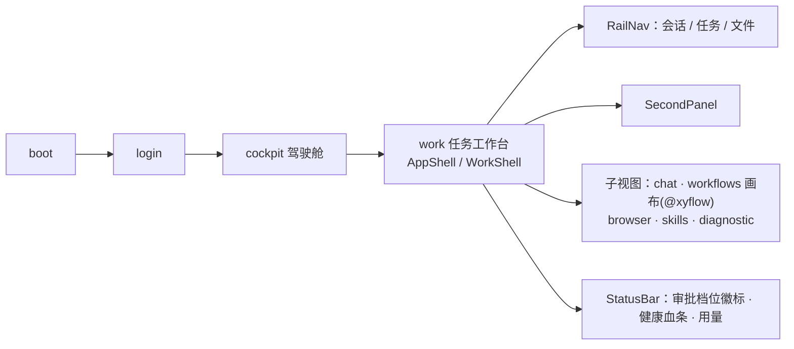
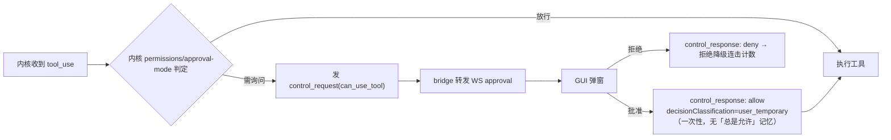

# YFWorking 应用架构图

> 应用：YFWorking Desktop v2.8.0（`package.json`）
> 架构真源：`electron/main.cjs`、`server/bridge.mjs`、`kernel/cli.mjs`、`docs/bridge-contract.md`
> 更新日期：2026-09-12

---

## 1. 全景分层图



---

## 2. 进程拓扑（运行态）



**拓扑要点**

| 事实 | 说明 |
|---|---|
| 桥是唯一中枢 | GUI 不直接接触内核；内核也不接触 GUI。替换内核只需保持「bridge 眼中的内核协议」 |
| 1 会话 = 1 内核进程 | 空闲 10min 被 `taskkill` 回收（不广播 `closed`），下次发消息 `--resume` 无缝重启 |
| 内核启动链 | Electron main → bridge → `bootstrapKernelToUserDir` 镜像到 `<home>/runtime/ponos-kernel/` → spawn |
| 内置浏览器无端口 | `webContents.debugger.attach('1.3')` 进程内 CDP，不走 9222 类端口 |
| 多入口 | `bin/cli.mjs`（CLI 模式）、`start.bat`、便携版 vbs 启动器共用同一 bridge |

---

## 3. 连接形态（两跳不同）

前端与内核之间**没有任何直连**，且两跳的连接形态完全不同：一跳是跨进程网络连接，一跳是进程内管道。



| 跳 | 物理形态 | 协议 | 代码位置 |
|---|---|---|---|
| ① 前端 → bridge | 跨进程网络连接（TCP 环回） | WebSocket `ws://localhost:51517` + HTTP REST 同端口 | `src/lib/config.ts:14`、`server/bridge.mjs:2314` |
| ② bridge → 内核 | 进程内管道 `stdio: ['pipe','pipe','pipe']` | NDJSON 双向流 | `server/bridge.mjs:1145`、`kernel/cli.mjs` |
| — 前端 → 内核 | **不存在这一跳** | — | — |

**三点澄清（避免误读为「壳到壳」）**

1. **前端那侧没有壳。** 渲染进程是浏览器沙箱，只能走网络协议（WS/HTTP），拿不到内核对端的进程句柄——形态上不存在直连的可能。
2. **内核那侧不是终端会话。** 无 PTY、无 TTY、无回显、无交互式 shell 语义；协议纯粹跑在管道上，一行一个 JSON（`--print --output-format stream-json`）。
3. **只有「启动动作」借了 cmd.exe。** `shell: true`（`server/bridge.mjs:1158`）让 cmd.exe 把 `"<node>" "<kernel cli.mjs>" …` 拉起（args 逐项 `q()` 引号转义，见 `server/bridge.mjs:1141-1145`），但 cmd.exe 仅作启动器、用完即退，与后续协议无关——这是 Windows 拉进程的实现细节，不是连接形态。

**进程归属**：内核是 **bridge 的子进程**，不是 Electron 的子进程；GUI、桌面宠物、浏览器执行器、Electron 主进程四者都只是 bridge 的 WS 客户端。

**为什么设计成这样**

| 动因 | 说明 |
|---|---|
| 内核可替换 | bridge 是唯一知晓内核协议的一侧，GUI 零改动即可换内核（替换边界见 `docs/bridge-contract.md` §9） |
| 安全收敛 | Origin 白名单（外部 Origin 一律 403）、审批弹窗、提问卡片在 bridge 汇聚；内核的浏览器自动化请求由 bridge 直连执行器、**不转发 GUI**（防敏感载荷泄漏） |
| 生命周期托管 | 会话 = 内核进程：空闲 10min 回收、`--resume` 无缝重启、6s 超时 `taskkill` 兜底，全由 bridge 管理，前端只持 `sessionId` |
| 多端复用 | 宠物、浏览器执行器、独立小窗天然共享同一中枢，无需各自接内核 |
| 出网唯一出口 | 模型调用（HTTPS 到 provider）发生在内核侧，前端永不直连 LLM |

> 若前端直连内核，内核协议会泄漏进 UI 层，替换成本立即失控——这正是「桥是唯一中枢」的意义。

---

## 4. 三层协议契约（bridge 为轴）



**内核 spawn 契约（摘要）**

```
"<node>" "<kernel cli.mjs>" \
  --print --output-format stream-json --input-format stream-json --verbose \
  --approval-mode <manual|auto|loose|bypass>          # loose 为默认
  [--dangerously-skip-permissions]                    # 仅 loose/bypass
  --permission-prompt-tool stdio \
  --disallowedTools AskUserQuestion \
  [--resume <sessionId>] \
  [--append-system-prompt-file <%TEMP%/yfw-prompt-<sid>.txt>] \
  [--model <provider 主模型>] [--add-dir <会话 cwd>] [--add-dir <技能根>]
```

**通道职责**

| 通道 | 方向 | 载荷 |
|---|---|---|
| WS `event` / `raw` / `stderr` / `approval` / `question` / `milestones` / `workflow_event` / `approval-mode-changed` | bridge → GUI | 内核事件转发与解析件 |
| WS `send` / `cancel` / `answer` / `approval-response` / `approval-mode` / `browser_control` | GUI → bridge | 用户操作 |
| HTTP REST | GUI → bridge | 文件、Office 转换、transcript、config、providers、skills、worktrees、workflows、logs、diag |
| stdin/stdout NDJSON | bridge ↔ 内核 | `user`/`control_request`/`control_response` ↔ `system`/`assistant`/`result`/`control_request`/`bridge_request`/`error` |

---

## 5. 前端视图与状态



| 层 | 技术 |
|---|---|
| 构建 | Vite 5（`base:'./'`，产物 `dist/`）+ TypeScript 5.7 |
| UI | React 18 · Tailwind · Radix UI · framer-motion · lucide-react |
| 对话渲染 | `@assistant-ui/react` · react-markdown + remark-gfm · 自研 CodeBlock/BoxdrawTable |
| 编辑器 | CodeMirror 6（多语言高亮） |
| 图 | `@xyflow/react`（工作流 DAG 画布） |
| 状态 | zustand（11 个 store） |
| 通信 | `ws` WebSocket + fetch REST（`src/lib/config.ts` 用编译期常量 `__BRIDGE_PORT__`） |

---

## 6. 内核（Ponos-turbo）模块地图

```mermaid
flowchart TB
    subgraph ENTRY["入口 / 协议"]
        cli["cli.mjs"] --- protocol["protocol.mjs"] --- approval["approval-mode.mjs"]
    end
    subgraph LOOP["Agent 循环"]
        engine["engine.mjs（循环守卫 + 无感自愈）"] --- api["api.mjs"] --- provider["provider.mjs"]
        engine --- context["context.mjs"] --- compact["compact.mjs"]
    end
    subgraph TOOLLAYER["工具与权限"]
        tools["tools.mjs"] --- permissions["permissions.mjs"]
        permissions --- highrisk["highrisk.mjs"] --- blacklist["blacklist.mjs"] --- readonly["readonly.mjs"]
    end
    subgraph KNOW["知识与能力"]
        skills["skills.mjs"] --- agents["agents.mjs"] --- memory["memory.mjs"] --- msearch["memory-search.mjs"] --- ssearch["skill-search.mjs"]
    end
    subgraph WFL["工作流引擎"]
        wfe["workflow-engine.mjs"] --- dsl["workflow-dsl.mjs"] --- dag["workflow-dag.mjs"] --- nodes["workflow-nodes.mjs"] --- wfm["workflow.mjs"]
    end
    subgraph PERSIST["持久化与观测"]
        session["session.mjs"] --- hooks["hooks.mjs"] --- audit["audit.mjs"] --- stats["stats.mjs"] --- cost["cost.mjs"] --- health["health.mjs"] --- fidelity["fidelity.mjs"] --- redact["redact.mjs"]
    end
    subgraph CFG["配置"]
        config["config.mjs"] --- settings["settings.mjs"] --- scan["config-scan.mjs"] --- dyntools["dyntools.mjs"] --- graph["graph.mjs"] --- prompt["prompt.mjs"] --- logm["log.mjs"] --- tui["tui.mjs"]
    end
    ENTRY --> LOOP
    LOOP --> TOOLLAYER
    LOOP --> KNOW
    LOOP --> WFL
    LOOP --> PERSIST
    ENTRY --> CFG
```

---

## 7. 审批与安全模型



| 档位 | 传 `--dangerously-skip-permissions` | 仍会询问的情形 |
|---|---|---|
| `manual` | 否 | 普通 Bash 也问 |
| `auto` | 否 | 工具层写文件、联网、子 Agent |
| `loose`（默认） | 是 | 仅高危 Bash 与灾难命令 |
| `bypass` | 是 | 仅灾难命令 |

**硬黑名单（不随档位放开）**：`rm -rf /`、`rm -rf ~`、`mkfs*`、`format X:`、`diskpart`、`dd of=/dev/…`、`shutdown/reboot/halt/poweroff` —— 四档都弹窗且文案为「本次放行」。

**WS 来源限制**：仅接受无 Origin / `file:` / `localhost` / `127.0.0.1` / `::1`，外部 Origin 一律 403。

---

## 8. 数据落点

```
<YFWORKING_HOME 默认 ~/.yfw>
├── config.json                # 配置（含 approvalMode 全局档、logPolicy、provider profile）
├── auth.json                  # 认证凭据
├── projects/<cwd 清洗名>/*.jsonl   # 内核 transcript = 权威对话档案（不受日志策略管辖）
├── sessions/  chats/          # 会话元数据 / 会话模式
├── runtime/ponos-kernel/      # 内核镜像（bootstrap 落地，专用目录名，不覆写在售旧版）
├── runtime/python/            # 内置便携 Python
├── skills/                    # 用户技能（内置技能来自 resources/runtime/skills）
├── workflows/<id>/workflow.yml + versions/<ts>.yml   # 工作流定义与版本快照（保留 20 份）
├── workflow-runs/<name>/*.jsonl                       # 工作流运行审计
├── logs/{app.log, kernel-stderr.log, renderer-console.log}[.1 .2 …]
├── memory/                    # 个人/项目经验库 + 索引
├── browser-whitelist.json
└── userData/                  # Electron userData 重定向落点
```

**日志策略**（`server/log-policy.cjs`，与 GUI `src/lib/logUi.ts` 逐位一致）：默认 `{ persist:true, level:'info', maxFileBytes:5MB, maxFiles:3, maxAgeDays:14 }`；钳制范围单文件 64KB–100MB、份数 0–20、天数 1–365。

---

## 9. 端口与版本隔离

| 资源 | 在售旧版 | 当前净室版 | 覆盖变量 |
|---|---|---|---|
| bridge HTTP+WS | 51309 | **51517** | `YFW_BRIDGE_PORT` |
| vite dev / preview | 5173 / 4173 | **5197 / 4197** | `YFW_VITE_PORT` / `YFW_VITE_PREVIEW_PORT` |
| 数据根 home | `~/.yfworking` | 默认 `~/.yfw` | `YFWORKING_HOME` |
| 内核运行时 | bun 布局 | **node** | 由调用方定位；`YFWORKING_KERNEL` 为唯一逃生口 |
| 内核落地目录 | `~/.yfworking/runtime/kernel`（绝不可覆写） | `<home>/runtime/ponos-kernel` | — |

---

## 10. 构建与发布链路

```mermaid
flowchart LR
    SRC["src/ (React/TS)"] -->|npm run build (tsc + vite)| DIST["dist/"]
    KSRC["kernel/*.mjs"] -->|scripts/build-kernel.mjs| KDIST["kernel-dist/cli.mjs (bundle)"]
    DIST --> DEV["release/YFWorking/ 调试便携版<br/>（手动 cp 同步，勿删）"]
    KSRC --> DEV
    VER["version.mjs"] --> DEV
    DIST --> INST["release/installer/YFWorking Setup x.y.z.exe<br/>（npm run build:electron → electron-builder）"]
    KDIST --> INST
```

> ⚠️ `release/YFWorking/` 是手动维护的调试环境，**绝不可 `rm -rf`**，也不要在 `release/` 根目录跑 `electron-builder`（详见 `BUILD.md`）。

---

## 11. 与可视化版的关系

- 本文件为**文本真源**（可 diff、可评审，Mermaid 可被 GitHub/VSCode 直接渲染）。
- 配套可视化版：`docs/architecture.html`（自包含、离线可开，用于汇报/演示）。
