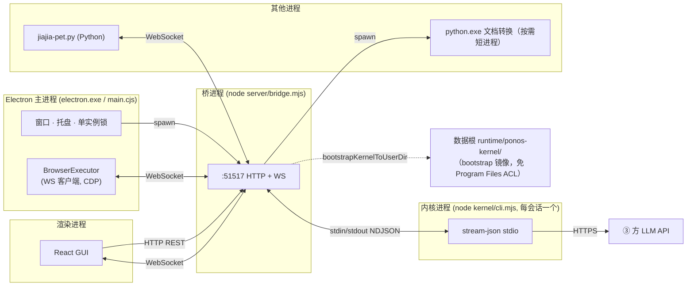
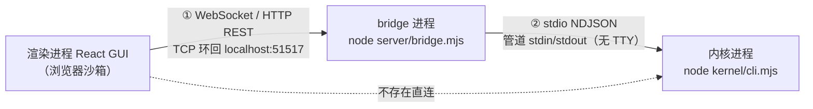
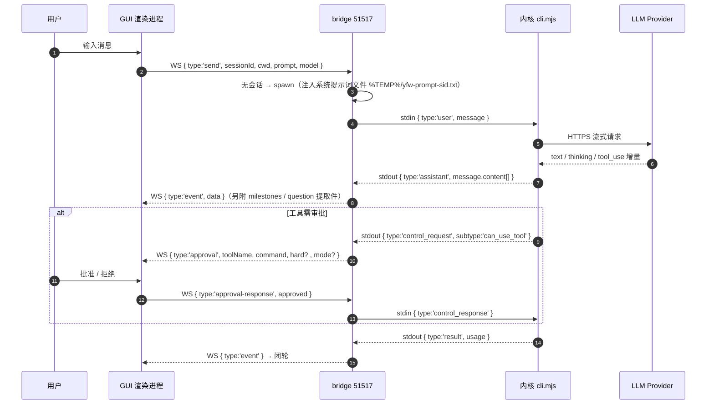
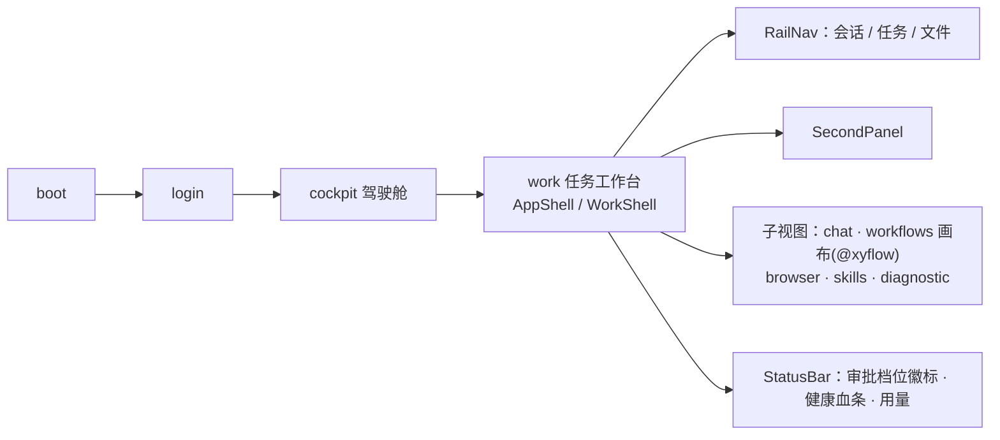
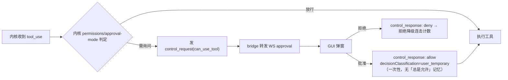

# YFWorking 应用架构图

> 应用：YFWorking Desktop v2.8.0（`package.json`）
> 架构真源：`electron/main.cjs`、`server/bridge.mjs`、`kernel/cli.mjs`、`docs/bridge-contract.md`；逐模块验证见 `docs/architecture-graph.html`（§12）
> 更新日期：2026-09-17（基线 `978447c` + 工作树未提交改动）

---

## 1. 全景分层图


---

## 2. 进程拓扑（运行态）



**拓扑要点**

| 事实 | 说明 |
|---|---|
| 桥是唯一中枢 | GUI 不直接接触内核；内核也不接触 GUI。替换内核只需保持「bridge 眼中的内核协议」 |
| 1 会话 = 1 内核进程 | 空闲 10min 被 `taskkill` 回收（不广播 `closed`），下次发消息 `--resume` 无缝重启 |
| 内核启动链 | Electron main → bridge → `bootstrapKernelToUserDir` 镜像到 `<home>/runtime/ponos-kernel/` → spawn |
| 内置浏览器无端口 | `webContents.debugger.attach('1.3')` 进程内 CDP，不走 9222 类端口 |
| 多入口 | `bin/cli.mjs`（CLI 模式）、`start.bat`、便携版 vbs 启动器共用同一 bridge |

---

## 3. 连接形态（两跳不同）

前端与内核之间**没有任何直连**，且两跳的连接形态完全不同：一跳是跨进程网络连接，一跳是进程内管道。



| 跳 | 物理形态 | 协议 | 代码位置 |
|---|---|---|---|
| ① 前端 → bridge | 跨进程网络连接（TCP 环回） | WebSocket `ws://localhost:51517` + HTTP REST 同端口 | `src/lib/config.ts:14`、`server/bridge.mjs:2314` |
| ② bridge → 内核 | 进程内管道 `stdio: ['pipe','pipe','pipe']` | NDJSON 双向流 | `server/bridge.mjs:1145`、`kernel/cli.mjs` |
| — 前端 → 内核 | **不存在这一跳** | — | — |

**三点澄清（避免误读为「壳到壳」）**

1. **前端那侧没有壳。** 渲染进程是浏览器沙箱，只能走网络协议（WS/HTTP），拿不到内核对端的进程句柄——形态上不存在直连的可能。
2. **内核那侧不是终端会话。** 无 PTY、无 TTY、无回显、无交互式 shell 语义；协议纯粹跑在管道上，一行一个 JSON（`--print --output-format stream-json`）。
3. **只有「启动动作」借了 cmd.exe。** `shell: true`（`server/bridge.mjs:1158`）让 cmd.exe 把 `"<node>" "<kernel cli.mjs>" …` 拉起（args 逐项 `q()` 引号转义，见 `server/bridge.mjs:1141-1145`），但 cmd.exe 仅作启动器、用完即退，与后续协议无关——这是 Windows 拉进程的实现细节，不是连接形态。

**进程归属**：内核是 **bridge 的子进程**，不是 Electron 的子进程；GUI、桌面宠物、浏览器执行器、Electron 主进程四者都只是 bridge 的 WS 客户端。

**为什么设计成这样**

| 动因 | 说明 |
|---|---|
| 内核可替换 | bridge 是唯一知晓内核协议的一侧，GUI 零改动即可换内核（替换边界见 `docs/bridge-contract.md` §9） |
| 安全收敛 | Origin 白名单（外部 Origin 一律 403）、审批弹窗、提问卡片在 bridge 汇聚；内核的浏览器自动化请求由 bridge 直连执行器、**不转发 GUI**（防敏感载荷泄漏） |
| 生命周期托管 | 会话 = 内核进程：空闲 10min 回收、`--resume` 无缝重启、6s 超时 `taskkill` 兜底，全由 bridge 管理，前端只持 `sessionId` |
| 多端复用 | 宠物、浏览器执行器、独立小窗天然共享同一中枢，无需各自接内核 |
| 出网唯一出口 | 模型调用（HTTPS 到 provider）发生在内核侧，前端永不直连 LLM |

> 若前端直连内核，内核协议会泄漏进 UI 层，替换成本立即失控——这正是「桥是唯一中枢」的意义。

---

## 4. 三层协议契约（bridge 为轴）



**内核 spawn 契约（摘要）**

```
"<node>" "<kernel cli.mjs>" \
  --print --output-format stream-json --input-format stream-json --verbose \
  --approval-mode <manual|auto|loose|bypass>          # loose 为默认
  [--dangerously-skip-permissions]                    # 仅 loose/bypass
  --permission-prompt-tool stdio \
  --disallowedTools AskUserQuestion \
  [--resume <sessionId>] \
  [--append-system-prompt-file <%TEMP%/yfw-prompt-<sid>.txt>] \
  [--model <provider 主模型>] [--add-dir <会话 cwd>] [--add-dir <技能根>]
```

**通道职责**

| 通道 | 方向 | 载荷 |
|---|---|---|
| WS `event` / `raw` / `stderr` / `approval` / `question` / `milestones` / `workflow_event` / `approval-mode-changed` | bridge → GUI | 内核事件转发与解析件 |
| WS `send` / `cancel` / `answer` / `approval-response` / `approval-mode` / `browser_control` | GUI → bridge | 用户操作 |
| HTTP REST | GUI → bridge | 文件、Office 转换、transcript、config、providers、skills、worktrees、workflows、logs、diag |
| stdin/stdout NDJSON | bridge ↔ 内核 | `user`/`control_request`/`control_response` ↔ `system`/`assistant`/`result`/`control_request`/`bridge_request`/`error` |

---

## 5. 前端视图与状态



| 层 | 技术 |
|---|---|
| 构建 | Vite 5（`base:'./'`，产物 `dist/`）+ TypeScript 5.7 |
| UI | React 18 · Tailwind · Radix UI · framer-motion · lucide-react |
| 对话渲染 | `@assistant-ui/react` · react-markdown + remark-gfm · 自研 CodeBlock/BoxdrawTable |
| 编辑器 | CodeMirror 6（多语言高亮） |
| 图 | `@xyflow/react`（工作流 DAG 画布） |
| 状态 | zustand（**15** 个 store：chat / view / auth / browser / diag / disabled / health / knowledge / mcp / settings / team / ui / warning / apps / agent） |
| 通信 | `ws` WebSocket + fetch REST（`src/lib/config.ts` 用编译期常量 `__BRIDGE_PORT__`） |

---

## 6. 内核（Ponos-turbo）模块地图

```mermaid
flowchart TB
    subgraph ENTRY["入口 / 协议"]
        cli["cli.mjs"] --- protocol["protocol.mjs"] --- approval["approval-mode.mjs"]
    end
    subgraph LOOP["Agent 循环"]
        engine["engine.mjs（循环守卫 + 无感自愈）"] --- api["api.mjs"] --- provider["provider.mjs"]
        engine --- context["context.mjs"] --- compact["compact.mjs"]
    end
    subgraph TOOLLAYER["工具与权限"]
        tools["tools.mjs"] --- permissions["permissions.mjs"]
        permissions --- highrisk["highrisk.mjs"] --- blacklist["blacklist.mjs"] --- readonly["readonly.mjs"]
    end
    subgraph KNOW["知识与能力"]
        skills["skills.mjs"] --- agents["agents.mjs"] --- memory["memory.mjs"] --- msearch["memory-search.mjs"] --- ssearch["skill-search.mjs"]
    end
    subgraph WFL["工作流引擎"]
        wfe["workflow-engine.mjs"] --- dsl["workflow-dsl.mjs"] --- dag["workflow-dag.mjs"] --- nodes["workflow-nodes.mjs"] --- wfm["workflow.mjs"]
    end
    subgraph PERSIST["持久化与观测"]
        session["session.mjs"] --- hooks["hooks.mjs"] --- audit["audit.mjs"] --- stats["stats.mjs"] --- cost["cost.mjs"] --- health["health.mjs"] --- fidelity["fidelity.mjs"] --- redact["redact.mjs"]
    end
    subgraph CFG["配置"]
        config["config.mjs"] --- settings["settings.mjs"] --- scan["config-scan.mjs"] --- dyntools["dyntools.mjs"] --- graph["graph.mjs"] --- prompt["prompt.mjs"] --- logm["log.mjs"] --- tui["tui.mjs"]
    end
    ENTRY --> LOOP
    LOOP --> TOOLLAYER
    LOOP --> KNOW
    LOOP --> WFL
    LOOP --> PERSIST
    ENTRY --> CFG
```

---

## 7. 审批与安全模型



| 档位 | 传 `--dangerously-skip-permissions` | 仍会询问的情形 |
|---|---|---|
| `manual` | 否 | 普通 Bash 也问 |
| `auto` | 否 | 工具层写文件、联网、子 Agent |
| `loose`（默认） | 是 | 仅高危 Bash 与灾难命令 |
| `bypass` | 是 | 仅灾难命令 |

**硬黑名单（不随档位放开）**：`rm -rf /`、`rm -rf ~`、`mkfs*`、`format X:`、`diskpart`、`dd of=/dev/…`、`shutdown/reboot/halt/poweroff` —— 四档都弹窗且文案为「本次放行」。

**WS 来源限制**：仅接受无 Origin / `file:` / `localhost` / `127.0.0.1` / `::1`，外部 Origin 一律 403。

---

## 8. 数据落点

```
<YFWORKING_HOME 默认 ~/.yfw>
├── config.json                # 配置（含 approvalMode 全局档、logPolicy、provider profile）
├── auth.json                  # 认证凭据
├── projects/<cwd 清洗名>/*.jsonl   # 内核 transcript = 权威对话档案（不受日志策略管辖）
├── sessions/  chats/          # 会话元数据 / 会话模式
├── runtime/ponos-kernel/      # 内核镜像（bootstrap 落地，专用目录名，不覆写在售旧版）
├── runtime/python/            # 内置便携 Python
├── skills/                    # 用户技能（内置技能来自 resources/runtime/skills）
├── workflows/<id>/workflow.yml + versions/<ts>.yml   # 工作流定义与版本快照（保留 20 份）
├── workflow-runs/<name>/*.jsonl                       # 工作流运行审计
├── logs/{app.log, kernel-stderr.log, renderer-console.log}[.1 .2 …]
├── memory/                    # 个人/项目经验库 + 索引
├── browser-whitelist.json
└── userData/                  # Electron userData 重定向落点
```

**日志策略**（`server/log-policy.cjs`，与 GUI `src/lib/logUi.ts` 逐位一致）：默认 `{ persist:true, level:'info', maxFileBytes:5MB, maxFiles:3, maxAgeDays:14 }`；钳制范围单文件 64KB–100MB、份数 0–20、天数 1–365。

---

## 9. 端口与版本隔离

| 资源 | 在售旧版 | 当前净室版 | 覆盖变量 |
|---|---|---|---|
| bridge HTTP+WS | 51309 | **51517** | `YFW_BRIDGE_PORT` |
| vite dev / preview | 5173 / 4173 | **5197 / 4197** | `YFW_VITE_PORT` / `YFW_VITE_PREVIEW_PORT` |
| 数据根 home | `~/.yfworking` | 默认 `~/.yfw` | `YFWORKING_HOME` |
| 内核运行时 | bun 布局 | **node** | 由调用方定位；`YFWORKING_KERNEL` 为唯一逃生口 |
| 内核落地目录 | `~/.yfworking/runtime/kernel`（绝不可覆写） | `<home>/runtime/ponos-kernel` | — |

---

## 10. 构建与发布链路

```mermaid
flowchart LR
    SRC["src/ (React/TS)"] -->|npm run build (tsc + vite)| DIST["dist/"]
    KSRC["kernel/*.mjs"] -->|scripts/build-kernel.mjs| KDIST["kernel-dist/cli.mjs (bundle)"]
    DIST --> DEV["release/YFWorking/ 调试便携版<br/>（手动 cp 同步，勿删）"]
    KSRC --> DEV
    VER["version.mjs"] --> DEV
    DIST --> INST["release/installer/YFWorking Setup x.y.z.exe<br/>（npm run build:electron → electron-builder）"]
    KDIST --> INST
```

> ⚠️ `release/YFWorking/` 是手动维护的调试环境，**绝不可 `rm -rf`**，也不要在 `release/` 根目录跑 `electron-builder`（详见 `BUILD.md`）。

---

## 11. 与可视化版的关系

- 本文件为**文本真源**（可 diff、可评审，Mermaid 可被 GitHub/VSCode 直接渲染）。
- 配套可视化版：`docs/architecture.html`（分层图版，自包含、离线可开，用于汇报/演示）。它有**自己的 12 章编排**，与本文件**不是逐节对应**：1 全景分层图 · 2 进程拓扑（运行态）· 3 两跳连接形态 · 4 一轮对话的端到端链路 · 5 应用智控链路 · 6 内核模块地图 · 7 审批与安全模型 · 8 数据落点 · 9 结构健康度 · 10 构建与发布链路 · 11 端口与版本隔离 · 12 已知风险与架构约束。差异：HTML 独有「端到端链路 / 应用智控链路 / 结构健康度」，本文件独有「三层协议契约 / 前端视图与状态」及 §11–§12；两者共享同一基线 `978447c`。
  两者口径一致性维护口径：**本文件为文本真源**；HTML 中取自失败运行的数字（DevLens 摘要覆盖率、LLM 安全标记）已按 §9 的相同口径标注为「未生成 / 已作废」，不构成冲突。
- 配套**交互式全模块图谱**：`docs/architecture-graph.html`（自包含、离线可开；覆盖全部 476 个源码模块，可点击 / 过滤 / 搜索，见 §12）。
- 上一版快照：`docs/architecture-history/2026-09-12-architecture.md` + `.html`。

---

## 12. 全模块索引（交互式图谱）

§1–§10 讲**分层与链路**，本节补**逐模块的完整索引**：476 个源码模块一个不漏，且不是人工清单，而是脚本从仓库真源扫出来的。

### 12.1 文件与再生成

| 文件 | 作用 |
|---|---|
| `docs/architecture-graph.html` | 交互式图谱（自包含、离线可开）；功能域视图 52 域 / 模块视图 476 模块 / 清单视图 |
| `scripts/build-arch-graph.mjs` | 生成器：扫描真源 → 抽取依赖边 → 注入模板 |
| `scripts/arch-graph.template.html` | 页面模板（原生 Canvas 力导向，零外部依赖，保证离线可用） |
| 重新生成 | `node scripts/build-arch-graph.mjs`（秒级；生成时自动做覆盖率自检） |

### 12.2 口径（决定这张图能证明什么、不能证明什么）

- **节点** = git 跟踪的源文件（`.ts/.tsx/.mjs/.cjs/.js/.py`）+ 根级模块（`version.mjs`、`vite.config.ts` 等）；排除 **391 个测试文件**与构建产物（`release/`、`dist/`、`kernel-dist/`）。
- **边** = 两类真实依赖：① 静态 `import` / `require` / `export…from` / 动态 `import()`；② **按路径引用**（字符串字面量指向仓库内真实文件，覆盖 `spawn` 与按路径加载，图中以**虚线**区分）。
- **抽取前先剔注释**——注释里提到的文件名不是依赖（未剔注释时会多出 143 条假边，典型是 11 条指向内核的「renderer→kernel」，实际全在注释里）。
- **不解析**：变量拼接的动态导入、`require(变量)`、构建产物内部引用、不存在的别名。

### 12.3 覆盖核对（脚本每次生成时自检，与 `git ls-files` 逐目录比对）

| 目录 | 已收录 / git 跟踪 | 目录 | 已收录 / git 跟踪 |
|---|---|---|---|
| `src/` | 251 / 251 ✅ | `shared/` | 21 / 21 ✅ |
| `electron/` | 36 / 36 ✅ | `bin/` | 1 / 1 ✅ |
| `kernel/` | 70 / 70 ✅ | `scripts/` | 29 / 29 ✅ |
| `server/` | 62 / 62 ✅ | `pet/` | 2 / 2 ✅ |

**未归类模块 0**。另有 2 个本地未跟踪文件在图中有标记（`scripts/pack-source-zip.mjs`、`scripts/package-portable-zip.mjs`）。

### 12.4 规模

| 分层 | 模块数 |
|---|---|
| ① 表现层（`src/`） | **251**（其中 13 个组件域） |
| ② 宿主层（`electron/`） | **36** |
| ③ 桥接层（`server/`） | **62** |
| ④ 内核层（`kernel/`） | **70** |
| 共享层（`shared/`） | **21** |
| 工具链 / 启动器（`bin/ scripts/ pet/` + 根级） | **38** |
| **合计** | **476 模块 · 118,802 行 · 1,274 条依赖边**（其中 49 条按路径引用） |

规模最大的功能域：`src/lib`（API 客户端与纯函数：76 模块 / 14,913 行）、`src/components/chat`（29）、`src/components/knowledge`（28）、应用智控宿主侧（23）。

### 12.5 结构事实（由边计算得出，非人工描述）

- **真正的公共面**（被依赖最多，改动波及最广）：`src/i18n/useTranslation.ts`（88）> `src/lib/utils.ts`（85）> `src/components/ui/index.ts`（71）> `src/types/index.ts`（44）> `src/stores/chatStore.ts`（38）> `src/lib/config.ts`（29）。
- **自身依赖最多**（重构成本最高）：`server/bridge.mjs`（40）> `kernel/cli.mjs`（37）> `src/components/layout/WorkShell.tsx`（30）。
- **跨层静态依赖**（含 49 条按路径引用）：`kernel→shared` 26 · `host→bridge` 15 · `bridge→shared` 11 · `bridge→kernel` 9 · `host→kernel` 4 · `host→shared` 3 · `bridge→host` 2 · `renderer→bridge` 1。另有 `tooling→renderer/host/bridge/kernel/shared` 共 38 条，全部来自 `scripts/verify-*-gui.mjs` 等**构建与验证脚本**（工具层引用运行层属正常，不计入架构纪律）。
- **分层纪律在静态依赖上成立**：`renderer→kernel`、`renderer→shared`、`bridge→renderer` 三组**均为 0 条**（`renderer→bridge` 仅 1 条、`bridge→host` 仅 2 条，均为点状而非面状）。前端对 `shared/knowledge-core.mjs` 的引用全部出现在**注释**里（口径说明），`src/lib/knowledgeBlocks.ts` 是**同口径重复实现**而非 import——刻意的进程隔离，代价是双份维护。
- **宿主层的例外确实存在**：`electron/app-llm.cjs:101-102` 用 `import('../kernel/api.mjs')`、`import('../kernel/provider.mjs')` **动态加载内核**（该文件头注释自称「不 require 内核」，指的是顶部静态依赖）。与「内核 ⊥ server 并非全局成立」同类——**不要把分层当作强制约束**。

### 12.6 孤立模块（25 个，无任何依赖关系）

构建 / 打包脚本、`server/office-fixtures/tools/*` 探针、根配置（`vite.config.ts`、`tailwind.config.ts`、`postcss.config.js`），以及下面这些**值得单独看一眼**的：

| 模块 | 说明 |
|---|---|
| `kernel/config-scan.mjs` | **独立 CLI 工具**（无 import 属设计如此，`node kernel/config-scan.mjs` 直接执行），已在本文档登记为工具脚本 |

> `shared/office-merge.mjs` 曾列在此处（"未接线的功能"）。**2026-09-18 已接线**（`server/office-merge-exec.mjs` 调用它），因此它不再孤立、已从本清单移出——详见 `docs/dead-code-triage.md` §六。

其余为构建/打包脚本、探针与根配置——**无 import 是其正常状态**，不是死代码。

孤立 ≠ 错误：图谱的「孤立」有**三种成因**——**废弃**（可删）、**工具/入口**（设计如此）、**未接线**（功能缺口，待决策）。**不能只看「无 import」就判死代码**；逐项判定与处置见 `docs/dead-code-triage.md`（图谱详情面板同样列出）。

### 12.7 图谱怎么用

- **功能域视图**（默认，52 域）：看清模块族群与跨域依赖；**双击某个域**下钻到该域的模块视图。
- **模块视图**（476 模块）：看单文件级依赖；**放大后标签逐步出现**（总览只标枢纽，避免 476 个标签糊成一片）。
- **点击节点** → 右侧详情：职责（文件头注释原样摘录）、依赖 / 被依赖（**列表项可点击跳转**）、按路径引用单独成组。
- 工具栏：分层开关、搜索（模块 / 域 / 路径 / 职责）、排序、适配视图 / 重排布局 / 暂停物理。
- **双击顶部标题**切换**清单视图**：476 行模块清单（按行数 / 连接数 / 分层 / 名称排序）+ §12.3 的覆盖核对表。
- 键位：滚轮缩放、拖拽画布与节点、`/` 聚焦搜索、`Esc` 取消选中。

### 12.8 布局质量（自动化实测，非目测）

用 Electron 无头渲染加载该文件并度量：功能域视图 **0 对圆形重叠**（最小间隙 39px）、64 个标签 **0 互压**、视图填充率 **80%**；模块视图 0 重叠、填充率 72%。交互项（点击联动详情、视图切换、分层过滤、搜索、清单视图、详情内跳转）实测全部通过。

> ⚠️ **上段数字的时效**：这批测量取自 **2026-09-12**，当时的规模是 **68 域 / 461 模块**。2026-09-17 的 **P2-2 域归并（68 → 52）**、后续模块增长与**死代码清理（461 → 476）**会改变域视图的圆半径与标签档位，**因此"64 个标签 / 填充率 80%"已不再是当前布局的实测值**，需重测。此处保留原值只为标注历史结论，不作为当下契约。
> 重测方式：用 Electron 无头加载 `docs/architecture-graph.html`，度量"圆形两两最小间隙 / 标签矩形互压对数 / 画布填充率"。当前仓库**没有**对应的自动化脚本（`scripts/verify-gui-fidelity.mjs` 度量的是主界面而非本图谱），故 P2-4 若要把它纳入门禁，需先补一个度量脚本。
