# Ponos 产品使用说明书

| 项目 | 内容 |
|---|---|
| 产品名称 | Ponos（企业咨询项目与开发的 AI 工作台） |
| 适用版本 | **2.2.0** |
| 更新日期 | 2026-08-07 |
| 运行平台 | Windows 10 / 11（64 位） |

> **关于截图**：本文档为图文并茂版本。每处截图已预留标准的图片引用（`images/` 目录，PNG 格式），并注明该截图应展示的内容。请按 [9.2 截图清单](#92-截图清单待补充) 补齐图片、保持文件名一致，即可自动嵌入渲染。

---

## 目录

1. [产品概述](#1-产品概述)
2. [系统要求与安装](#2-系统要求与安装)
3. [界面总览](#3-界面总览)
4. [快速上手](#4-快速上手)
5. [功能详解](#5-功能详解)
6. [设置详解](#6-设置详解)
7. [快捷键一览](#7-快捷键一览)
8. [常见问题（FAQ）](#8-常见问题faq)
9. [附录](#9-附录)

---

## 1. 产品概述

### 1.1 产品简介

Ponos 是一款面向**企业咨询项目与软件开发**的 AI 桌面工作台。它将 AI 编码助手的能力与企业咨询业务场景深度结合，覆盖**申报材料整理、核心表格生成、审计核对、系统诊断**等典型工作流，帮助咨询顾问、项目申报人员与开发者在桌面端一站式完成 AI 驱动的复杂任务。

Ponos 基于 Electron 构建，采用本地桥接服务连接模型 API，开箱即用，无需手动配置命令行环境。

### 1.2 核心特性

- **AI 对话工作台**：工作目录绑定、附件/图片/语音输入、流式输出、斜杠命令、技能一键调用、消息撤销重做。
- **企业申报场景能力**：内置高新申报（RD/PS/IP/TOAI 核心表格）、审计核对、材料整理等**专业智能体**与全套**技能包**。
- **多模型供应商**：内置 DeepSeek、MiniMax 预设，支持添加任意 Anthropic 兼容 API 供应商，并提供连通性测试。
- **技能体系**：技能包安装/卸载/更新、常用技能收藏、技能文件夹分类、自动经验捕获。
- **文件与开发能力**：文件浏览器、内嵌文件查看器（多标签）、多标签终端、Git 工作树、代码审查与提交。
- **桌面宠物「嘉嘉」**：像素机器人实时联动任务状态，支持大小调节与随机气泡。
- **个性化**：四套主题、中英双语界面、托盘后台运行、通知时机可选。

### 1.3 适用场景

- 高新技术企业认定申报：材料整理、RD/PS/IP/TOAI 核心表格生成、研发费用/高新收入专项审计报告核对。
- 企业资质申报：科技型中小企业、专精特新、瞪羚、独角兽、单项冠军等资质申报。
- 企业文档处理：Word / Excel / PPT / PDF 的生成、排版与格式转换。
- 网页信息处理：政策文件抓取、申报系统表单填充、企业公开信息核验。
- 通用软件开发：项目规划、代码编写、代码审查、Git 工作树管理等。

---

## 2. 系统要求与安装

### 2.1 系统要求

| 项目 | 要求 |
|---|---|
| 操作系统 | Windows 10 / 11（64 位） |
| 内存 | 建议 4 GB 及以上 |
| 磁盘空间 | 安装约需 500 MB（含内置 Python 运行时与技能包） |
| 网络 | 需可访问模型 API 服务（默认供应商 DeepSeek / MiniMax） |

### 2.2 安装步骤

1. 运行安装包 `Ponos Setup 2.2.0.exe`。
2. 按向导选择安装目录（默认安装到当前用户目录，无需管理员权限，可自定义路径）。
3. 安装完成后自动启动应用，并同时在**桌面**与**开始菜单**生成「Ponos」快捷方式。
4. 首次启动进入欢迎页，可从快捷场景开始使用。

**截图内容**：欢迎页 / 开始使用界面，展示六个快捷场景卡片：「整理高新技术企业申报材料」「生成 RD/PS/IP 核心表格」「核对研发费用专项审计报告」「分析磁盘空间和系统性能」「帮我规划并搭建这个项目」「查看并安装内置技能」。

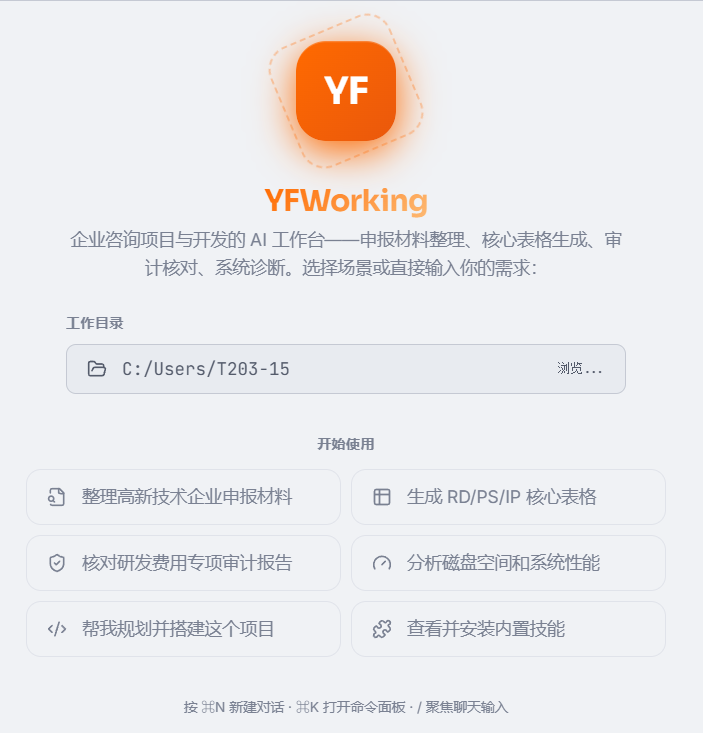

> 便携版说明：项目还提供免安装的调试便携版（`release/Ponos/`），可直接运行，详情见项目 `BUILD.md`。

---

## 3. 界面总览

### 3.1 主界面布局

主界面自上而下分为五个区域：

| 区域 | 说明 |
|---|---|
| **顶栏** | 应用 Logo、侧边栏开关、当前对话标题、搜索 / 命令面板 / 主题 / 设置按钮、窗口控制按钮 |
| **侧边栏** | 六个标签页：对话、文件、工作树、历史、智能体、技能 |
| **聊天区** | 消息流（思考 / 工具调用 / 代码块等）与底部输入框 |
| **查看区** | 内嵌文件查看器面板（可开合，显示在聊天区下方，只读浏览文件内容） |
| **状态栏** | 连接状态、当前模型、后台任务、Token 用量、权限模式 |

**截图内容**：主界面总览——完整窗口截图，包含顶栏、展开的侧边栏（对话标签页）、空白欢迎对话区、底部输入框与状态栏。

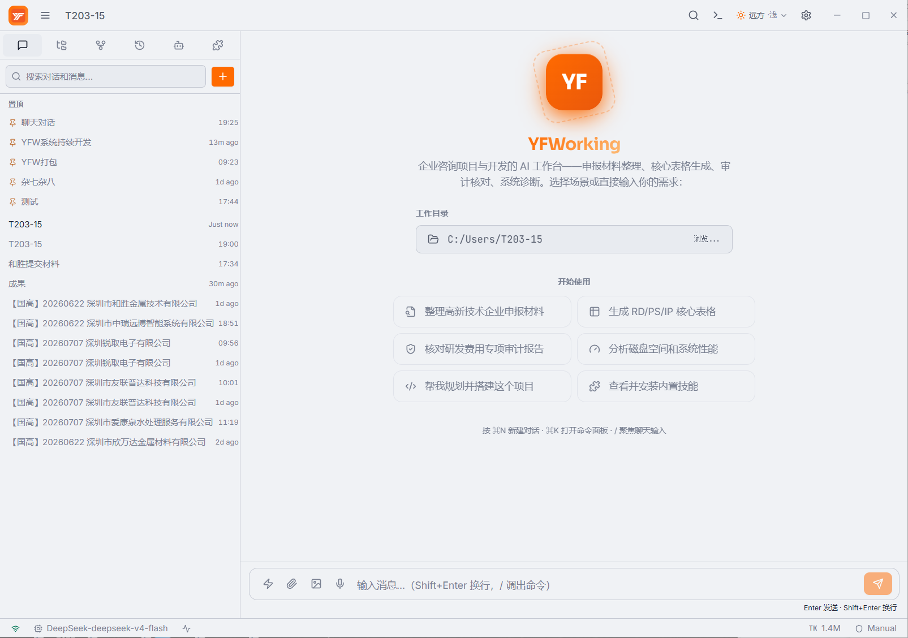

### 3.2 顶栏

- **左侧**：应用 Logo 与侧边栏开关按钮（`Ctrl+B`）。
- **中部**：当前对话标题。
- **右侧**（从左到右）：
  - 搜索按钮（`Ctrl+Shift+F`）
  - 命令面板按钮（`Ctrl+K`）
  - 主题切换下拉（四套主题缩略预览）
  - 设置按钮（`Ctrl+,`）
  - 窗口最小化 / 最大化 / 关闭按钮

**截图内容**：顶栏右侧工具区，展开「主题切换」下拉菜单，展示四套主题缩略预览。

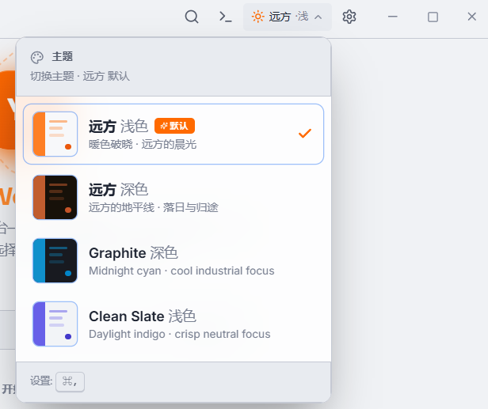

### 3.3 侧边栏

侧边栏顶部为六个标签页（图标从左到右）：

1. **对话** — 会话列表、搜索、新建、置顶/重命名/删除、拖拽排序
2. **文件** — 资源管理器，浏览项目与磁盘文件
3. **工作树** — Git Worktree 管理
4. **历史** — 历史会话回顾
5. **智能体** — 专业智能体与内置智能体
6. **技能** — 技能包管理

各标签页的详细说明与截图见 [第 5 章](#5-功能详解)。

### 3.4 状态栏

- **左侧**：连接状态（已连接 / 已断开）、当前模型标识（例如 `DeepSeek-deepseek-chat`）。
- **右侧**：后台任务数、累计 Token 用量（自动以 K/M 缩写显示）、权限模式（`Auto` 自动批准 / `Manual` 手动确认）。

**截图内容**：状态栏特写，显示「已连接」、模型标识、Token 用量与权限模式。

---

## 4. 快速上手

### 4.1 新建对话

- 点击侧边栏「新建对话」按钮（＋），或按 **`Ctrl+N`**。
- 新对话会展示欢迎页，提供 6 个快捷场景建议，点击即可直接开始：
  1. 整理高新技术企业申报材料
  2. 生成 RD/PS/IP 核心表格
  3. 核对研发费用专项审计报告
  4. 分析磁盘空间和系统性能
  5. 帮我规划并搭建这个项目
  6. 查看并安装内置技能

### 4.2 选择工作目录

- 每个对话可绑定一个**工作目录**，AI 将基于该目录执行文件读写与命令，方便针对具体项目工作。
- 按 **`/`** 键可快速聚焦输入框。

### 4.3 发送消息

1. 在输入框输入自然语言需求。
2. 按 **`Enter`** 发送，**`Shift+Enter`** 换行。
3. 响应以流式输出；输出过程中按钮变为「停止」，也可按 **`Esc`** 中断。
4. 支持附加文件、图片、语音输入，以及拖拽 / 粘贴文件（详见 5.2）。

---

## 5. 功能详解

### 5.1 对话管理（侧边栏「对话」标签页）

- **新建**：顶部 ＋ 按钮或 `Ctrl+N`。
- **搜索**：列表顶部搜索框按标题过滤会话。
- **右键菜单**：右键会话项弹出操作菜单——重命名、置顶 / 取消置顶、添加标签、删除。
- **拖拽排序**：拖动会话项可调整先后顺序。
- **状态指示**：正在流式输出的会话显示旋转动画与「执行中」，并显示相对更新时间。
- **置顶分组**：被置顶的会话固定在列表顶部。

**截图内容**：侧边栏-对话标签页，展示会话列表（含置顶分组、搜索框、新建按钮），并展开一个会话的右键上下文菜单。

### 5.2 聊天交互（输入框）

输入框从左到右提供以下工具：

| 图标 | 功能 | 说明 |
|---|---|---|
| 闪电 | **技能选择** | 选择收藏的常用技能，发送时自动注入技能启动指令；输入框上方显示技能徽章，可取消 |
| 回形针 | **附加文件** | 文本/代码等常见格式内联读取，或引用文件绝对路径 |
| 图片 | **附加图片** | 支持 jpg / png / gif / webp / bmp / svg 等 |
| 麦克风 | **语音输入** | 基于 Web Speech API 的语音转文字，支持中英文，再次点击停止录音 |

其他交互能力：

- **拖拽与粘贴**：将文件直接拖入输入框，或从剪贴板粘贴图片 / 文件。
- **斜杠命令菜单**：输入 `/` 自动弹出命令菜单（内置命令 + 已安装技能），`↑/↓` 选择、`Enter` 或 `Tab` 补全。
- **撤销 / 重做**：输入框内 `Ctrl+Z` / `Ctrl+Y`。
- **附件预览**：已添加的附件以标签形式显示在输入框上方，可单个移除。

**截图内容**：输入框，展示已选技能徽章、多个附件预览标签、语音输入激活状态。

内置斜杠命令：

| 命令 | 说明 | 命令 | 说明 |
|---|---|---|---|
| `/help` | 显示帮助 | `/model` | 切换模型 |
| `/clear` | 清空对话 | `/theme` | 更换主题 |
| `/compact` | 压缩对话上下文 | `/review` | 审查代码变更 |
| `/config` | 打开设置 | `/commit` | 生成提交信息 |
| `/cost` | 查看使用费用 | `/agents` | 管理智能体 |
| `/doctor` | 运行系统诊断 | `/mcp` | MCP 服务器管理 |
| `/export` | 导出对话 | `/memory` | 打开记忆文件 |
| `/init` | 初始化项目配置 | | |

**消息内容**：助手回复支持 Markdown 渲染（代码块一键复制 / 展开）、思考过程（Thinking）与工具调用（工具）折叠卡片、表格渲染；消息底部显示字符数，命令执行结果显示退出码；用户消息支持复制、重新生成、编辑、删除。

**截图内容**：聊天对话示例，包含用户消息、助手回复（含代码块）、思考过程卡片、工具调用与执行结果。

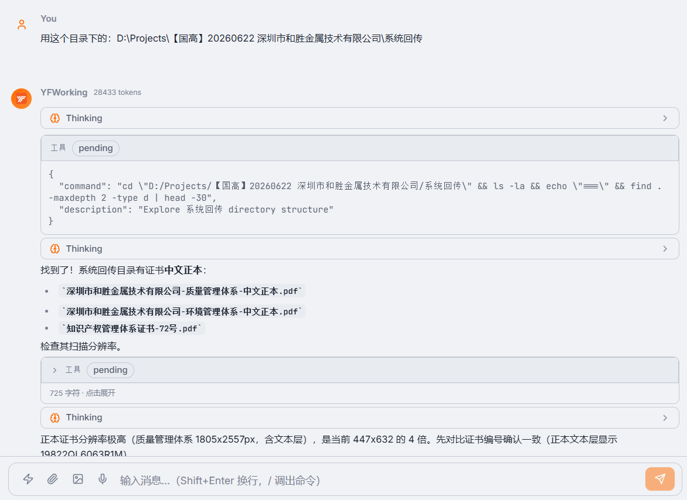

### 5.3 文件浏览器（侧边栏「文件」标签页）

- **顶部操作**：返回上级目录、主目录、此电脑（驱动器列表）、刷新。
- **文件操作**（悬停或右键）：预览、附加到对话、在查看器中打开、复制路径、在资源管理器中打开。
- **支持的预览格式**：`.docx`、`.xlsx`、`.xls`；`.doc`、`.ppt`、`.pptx` 为旧版 Office 格式无法预览，会弹出提示说明。
- 文件可**附加到当前对话**，或在**内嵌文件查看器**中打开（多标签、只读浏览，随时关闭标签）。

**截图内容**：侧边栏-文件标签页，目录树浏览，展示文件操作菜单。

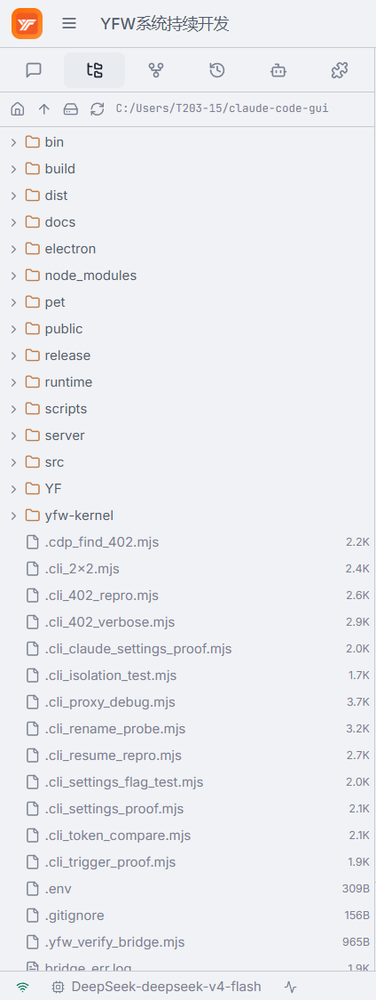

**截图内容**：内嵌文件查看器，底部面板展开，多个文件标签与文件内容只读显示。

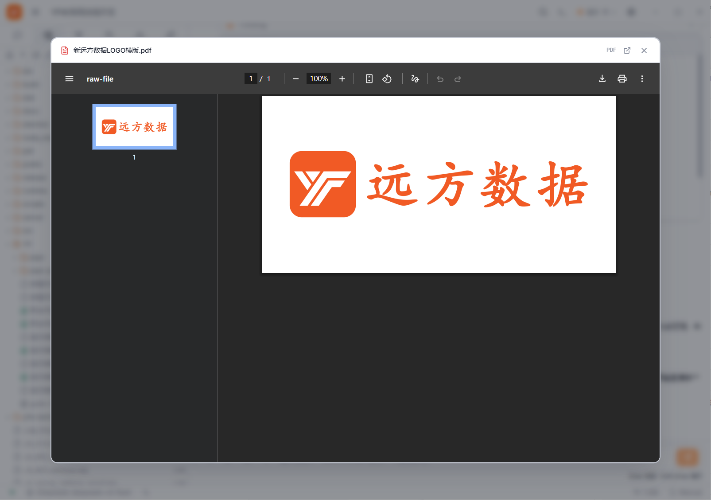

### 5.4 工作树（侧边栏「工作树」标签页）

- 输入**分支 / 引用**与目标路径，创建新的 Git Worktree 工作树。
- 列表展示每个工作树的分支名、路径与关联会话数。
- 支持打开对应会话、移除工作树。
- 需在 Git 仓库目录下使用。

**截图内容**：侧边栏-工作树标签页，展示工作树列表与创建表单。

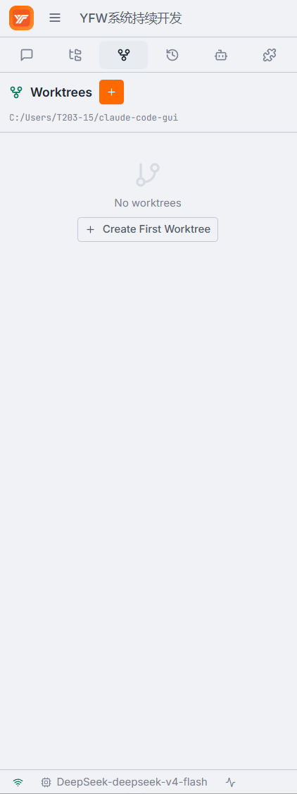

### 5.5 历史（侧边栏「历史」标签页）

- 按会话展示历史消息摘要与 Token 用量等信息，方便回顾此前工作。

**截图内容**：侧边栏-历史标签页，历史会话摘要列表。

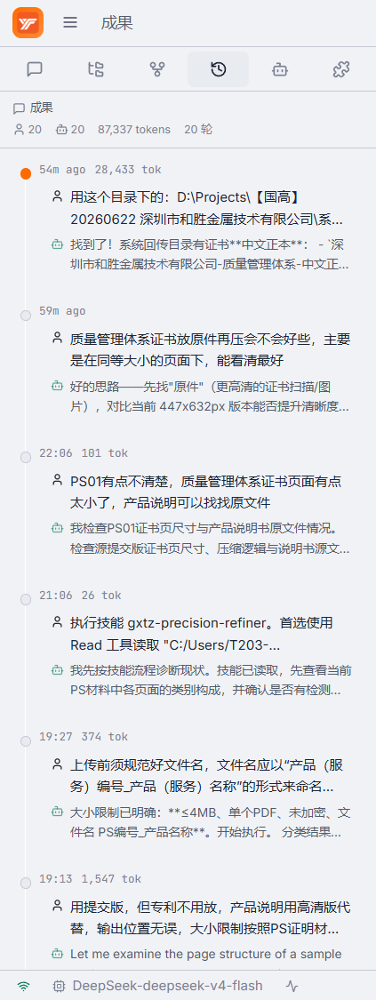

### 5.6 智能体（侧边栏「智能体」标签页）

**专业智能体**（面向企业咨询场景）：

| 智能体 | 职责 |
|---|---|
| 材料撰写专家 | 撰写研发立项报告、管理制度、成果转化等申报材料，专业正式、数据可溯源 |
| 表格处理专家 | RD/PS/知识产权/科技人员/TOAI 等核心表格生成，严格遵循模板零误差 |
| 审计核对专员 | 研发费用 / 高新收入专审报告核对，多维度一致性校验 |
| 申报打包工程师 | 申报材料扫描排序、合并压缩、命名合规校验，生成最终上传包 |
| 资料收集专员 | 企业信息调查、收资清单生成与资料完备性检查 |
| 经验沉淀助手 | 项目经验沉淀、跨会话知识汇聚，驱动技能持续迭代 |

**内置智能体**（通用开发）：

| 智能体 | 职责 |
|---|---|
| Ponos | 通用任务智能体（General-purpose agent） |
| Explore | 只读搜索智能体，广度并行搜索 |
| General Purpose | 多步任务执行与代码搜索 |
| Plan | 软件架构师，设计实施方案 |

**截图内容**：侧边栏-智能体标签页，专业智能体与内置智能体列表。

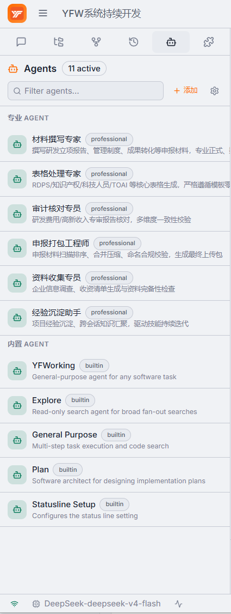

### 5.7 技能管理（侧边栏「技能」标签页）

技能面板提供完整的技能包管理能力：

- **搜索**：按名称/描述过滤技能。
- **文件夹分类**：默认 Working / Coding 两个分组，可新建、重命名、删除自定义文件夹，并可将技能归入指定文件夹。
- **常用技能**：点击星标 ★ 收藏（最多 10 个），收藏后可在输入框的技能选择器中快速选用。
- **技能卡片信息**：名称、版本、描述、触发词、来源（内置 / 手动安装）。
- **操作按钮**：
  - **快速运行**：自动生成技能执行指令并发送到对话。
  - **插入**：在输入框插入 `/技能名` 命令。
  - **安装 / 卸载 / 更新**：选择含 `SKILL.md` 的技能包目录或 `.yfskill` 文件进行安装。
  - **详情**：查看技能说明、附属脚本与模板文件。

内置技能按业务领域划分：`gxtz-*`（高企申报）、`yfwdoc-*`（企业文档）、`yfwweb-*`（网页处理）、`yfwx-*`（行业资质申报）等。

**截图内容**：侧边栏-技能标签页，展示技能列表、常用技能分组与文件夹分类。

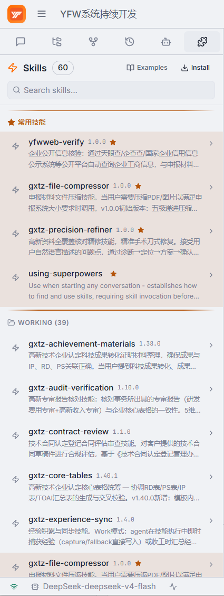

### 5.8 终端

- 按 **`Ctrl+J`** 开合底部终端面板。
- 支持多标签终端：新建终端、关闭终端、清空输出。
- 与应用任务联动，可查看任务执行输出。

**截图内容**：终端面板，底部展开状态，展示多标签页与命令输出。

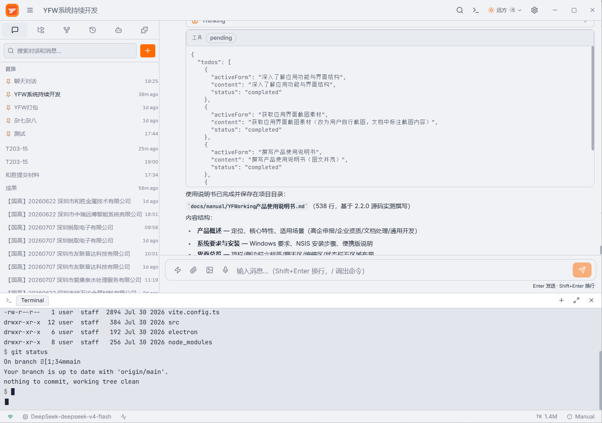

### 5.9 搜索

- 按 **`Ctrl+Shift+F`** 打开搜索对话框。
- 可检索**所有对话与消息**的内容，点击结果跳转到对应会话。

**截图内容**：搜索对话框，输入关键词后的搜索结果列表。

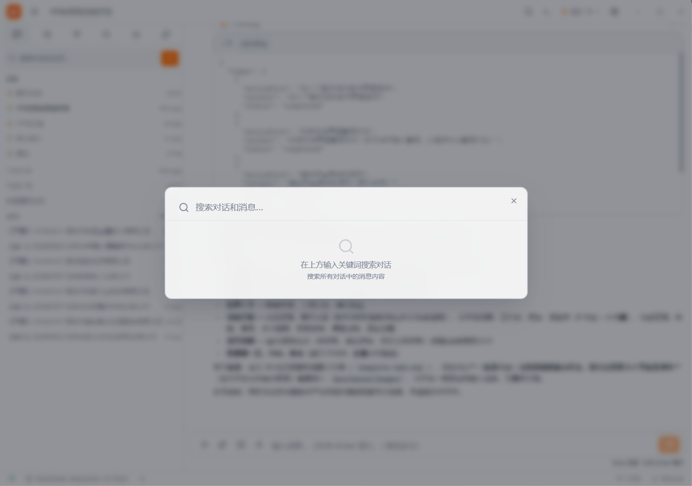

### 5.10 命令面板

- 按 **`Ctrl+K`**（或 `Ctrl+Shift+P`）打开。
- 按类别组织命令：对话、视图、导航、主题、帮助、文件、工具。
- 常用命令一览：

| 命令 | 说明 |
|---|---|
| 新建对话 | 开始新的对话 |
| 切换侧边栏 | 显示或隐藏侧边栏 |
| 打开设置 | 配置应用程序 |
| 切换主题 | 循环切换全部主题 |
| 键盘快捷键 | 查看快捷键帮助 |
| 聚焦输入框 | 跳转到消息输入框 |
| 导出对话 | 导出为 Markdown |
| 对话历史 / 浏览文件 | 打开对应面板 |
| 切换终端 | 显示或隐藏终端 |
| 运行诊断 | 检查系统配置 |
| 分享对话 | 创建分享链接 |
| 调试控制台 | 打开开发者工具 |
| 记忆文件 | 编辑项目记忆文件 |

**截图内容**：命令面板，展示命令搜索与分类。

### 5.11 权限控制

- 当 AI 请求**读取 / 写入文件、执行命令、网页搜索**时，会弹出权限请求对话框。
- 可对本次请求选择：**允许 / 拒绝 / 始终允许**。
- 状态栏右下角显示当前权限模式：`Auto`（自动批准）/ `Manual`（手动确认）。

> 提示：在「自动批准（Auto）」模式下，常见的文件读写与命令执行会自动放行，权限对话框仅在需要额外确认的场景才会出现。

### 5.12 桌面宠物「嘉嘉」

- 在「设置 → 桌面宠物」中启用后，桌面显示像素机器人嘉嘉。
- 与应用任务**实时联动**：任务执行 / 完成时宠物有对应表现；应用最小化到托盘后仍会联动。
- 可调节**大小**（25%–200%）与**随机气泡**（空闲时弹出气泡语）。
- 由独立 Python 进程驱动，关闭主窗口后仍可运行。

**截图内容**：桌面宠物嘉嘉，桌面角落的像素机器人（含气泡）。

### 5.13 主题

四套主题可在顶栏下拉或「设置 → 通用」中切换：

| 主题 | 风格 |
|---|---|
| 远方 · 浅色（默认） | 暖色朝霞、羊皮纸质感 |
| 远方 · 深色 | 落日余晖深色风格 |
| Graphite · 深夜靛蓝 | 石墨 + 靛蓝 |
| Clean Slate · 日光靛蓝 | 干净简洁、日光靛蓝 |

**截图内容**：主题切换下拉菜单，四套主题缩略预览（复用 `02-header-theme.png`，无需单独截图）。

---

## 6. 设置详解

打开方式：顶栏齿轮按钮，或按 **`Ctrl+,`**。设置窗口左侧导航分为五个部分。

### 6.1 通用

- **语言**：简体中文 / English（即时切换界面语言）。
- **主题**：四套主题卡片预览，点击即切换。
- **外观**：字体大小 12–20 px。
- **后台与通知**：
  - **关闭时最小化到托盘**：启用后点击关闭按钮将隐藏到系统托盘，应用在后台继续运行任务。
  - **任务完成通知时机**：后台才通知 / 始终通知。

**截图内容**：设置-通用，语言选择、主题卡片、字体大小与托盘通知选项。

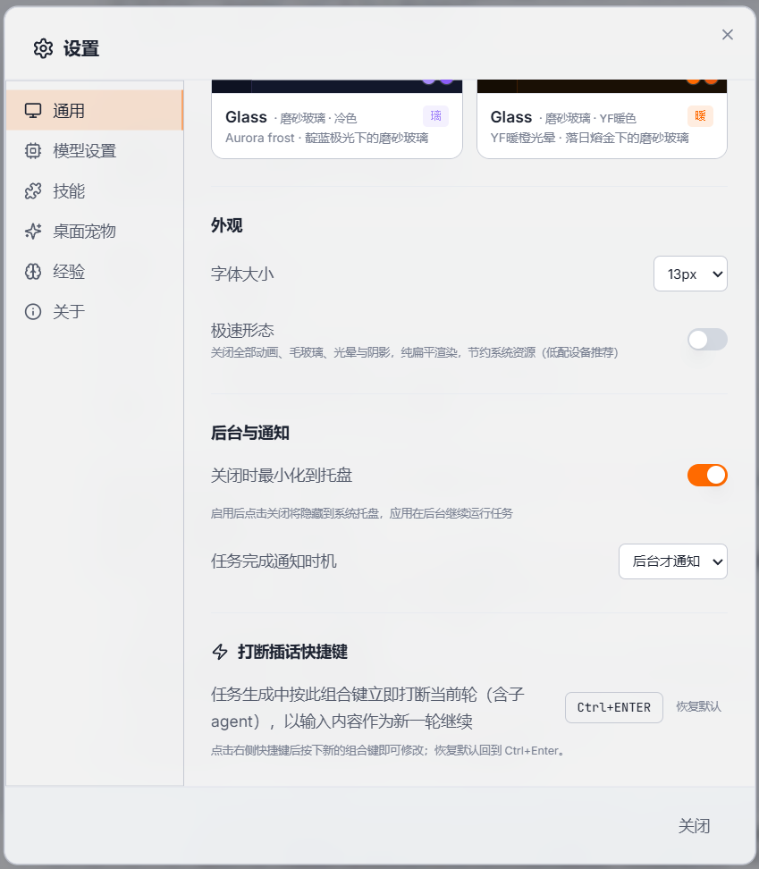

### 6.2 模型设置

- **当前供应商**：下拉选择生效的模型供应商（内置 DeepSeek / MiniMax 预设，或自定义供应商）。
- **供应商配置**（折叠面板）：
  - 供应商名称（内置预设不可修改）
  - API 端点
  - 认证令牌（安全存储，输入框以密码形式展示）
  - 主模型（会话使用）
  - 子代理模型（子任务使用）
- **高级设置**（折叠面板）：
  - 推理深度：low / medium / high / max
  - 上下文窗口：模型最大上下文长度（tokens）
- **添加自定义供应商**：填写名称、API 端点、可用模型列表（逗号分隔），支持任意 Anthropic 兼容 API。
- **删除供应商**：仅自定义供应商可删除，删除时一并移除 API 密钥。
- **测试连接**：校验 API 可达性与密钥有效性（成功 / 不可达 / 密钥无效等提示）。
- **保存**：保存配置，保存后自动在后台校验连通性。

**截图内容**：设置-模型设置，供应商下拉、供应商配置表单、「测试连接」与「保存」按钮。

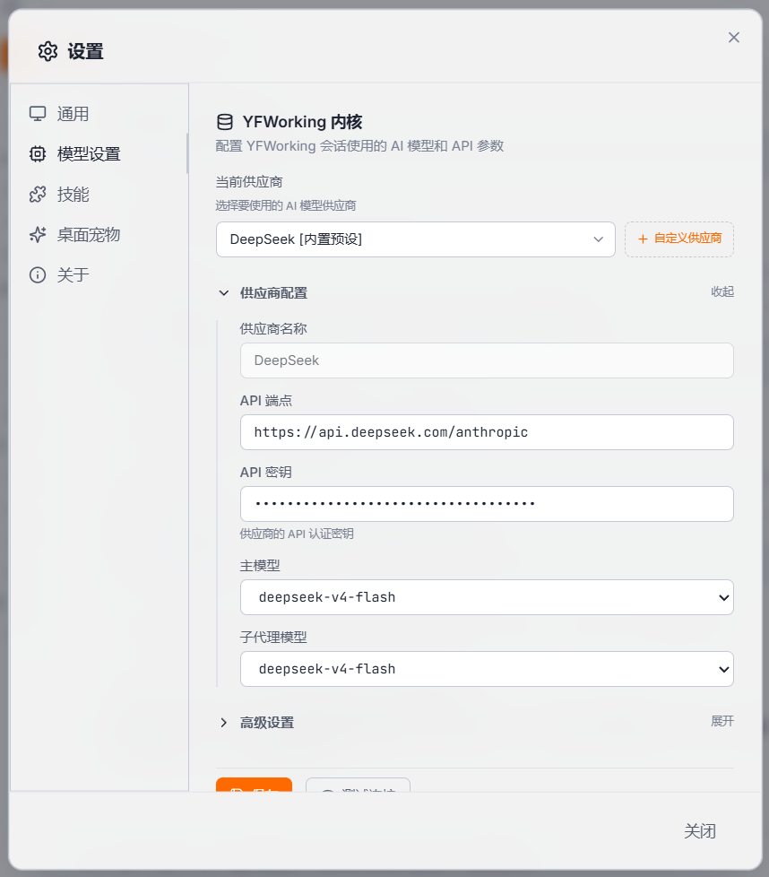

**截图内容**：添加自定义供应商对话框，名称、API 端点、模型列表输入。

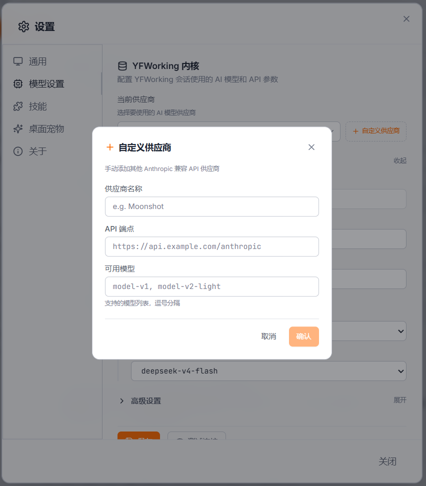

### 6.3 技能

- **技能目录**：技能包安装位置（只读显示，可点击刷新）。
- **自动捕获经验**：会话结束时自动汇总工作经验和技能反馈。
- **已安装技能**：显示已安装技能数量，并提示在侧边栏「技能」标签页管理安装与卸载。

**截图内容**：设置-技能，技能目录、自动捕获经验开关与已安装技能统计。

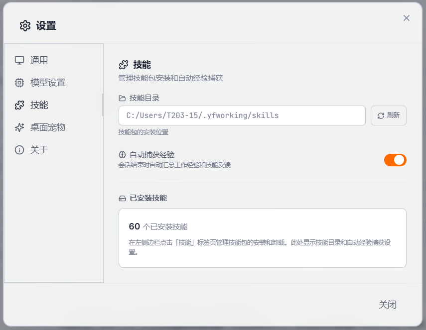

### 6.4 桌面宠物

- **启用桌面宠物**：开关。
- **宠物大小**：滑块 25%–200%。
- **随机气泡**：开关（空闲时随机弹出气泡语）。

**截图内容**：设置-桌面宠物，启用开关、大小滑块与随机气泡开关。

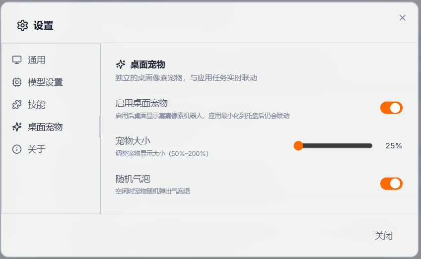

### 6.5 关于

- 版本号（当前为 2.2.0）
- Bridge 连接状态（已连接 / 已断开）
- CLI Session 当前会话模型

**截图内容**：设置-关于，版本号、桥接状态与会话模型。

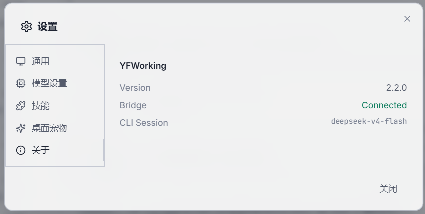

---

## 7. 快捷键一览

> Windows 下 `⌘` 等价于 `Ctrl`。

| 快捷键 | 功能 |
|---|---|
| `Ctrl+K` / `Ctrl+Shift+P` | 打开命令面板 |
| `Ctrl+,` | 打开设置 |
| `Ctrl+N` | 新建对话 |
| `Ctrl+B` | 切换侧边栏 |
| `Ctrl+J` | 切换终端 |
| `Ctrl+Shift+F` | 搜索对话与消息 |
| `/` | 聚焦聊天输入框 |
| `?` | 快捷键帮助 |
| `Enter` | 发送消息 |
| `Shift+Enter` | 换行 |
| `Ctrl+Z` / `Ctrl+Y` | 输入框内撤销 / 重做 |
| `Esc` | 停止流式输出 |
| `↑` / `↓` + `Enter`（斜杠菜单） | 选择并补全命令 |

> 提示：在任意界面按 `?` 可随时打开快捷键帮助。

---

## 8. 常见问题（FAQ）

| 问题 | 解答 |
|---|---|
| 启动后没有窗口？ | 检查 51311 端口是否被占用；可通过环境变量 `PONOS_BRIDGE_PORT` 修改端口后重启应用 |
| 提示 `listen EACCES: permission denied 0.0.0.0:3099`？ | 旧版本默认端口处于 Windows WinNAT 预留段（3095-3194）被封锁，请使用 51311 端口的版本 |
| 无法连接模型 API？ | 在「设置 → 模型设置」点击「测试连接」；确认 API 端点与密钥填写正确 |
| `.doc` / `.ppt` / `.pptx` 文件无法预览？ | 这些是旧版 Office 格式，暂不支持预览，请转换为 `.docx` / `.xlsx` 后再预览 |
| 桌面出现两个同名「Ponos」快捷方式？ | 便携版与安装版快捷方式同名但指向不同，删除不需要的那个即可 |
| 点击关闭后任务仍在运行？ | 已启用「关闭时最小化到托盘」，应用在后台继续执行任务，可从托盘图标恢复 |
| 模型配置修改后不生效？ | 在「设置 → 模型设置」点击「保存」并等待「配置已保存」提示 |

---

## 9. 附录

### 9.1 端口与配置

- **桥接服务器端口**：默认 `51311`，由环境变量 `PONOS_BRIDGE_PORT` 控制（设置后重启应用生效）。
- **模型配置文件**：`~/.ponos/settings.json`（CLI 与桌面端共享）。
- **技能默认目录**：`~/.ponos/skills`。

### 9.2 截图清单（待补充）

请按以下清单补充界面截图，存放于 `docs/manual/images/` 目录（与本文档同级），文件名保持一致，文档即会自动嵌入：

| 文件名 | 截图内容 |
|---|---|
| `01-main.png` | 主界面总览（完整窗口，含侧边栏与空白对话区） |
| `02-header-theme.png` | 顶栏 + 主题切换下拉菜单 |
| `03-statusbar.png` | 状态栏特写（连接状态 / 模型 / Token / 权限模式） |
| `04-welcome.png` | 欢迎页快捷场景卡片 |
| `05-sidebar-chats.png` | 侧边栏-对话（含右键上下文菜单） |
| `06-chat-input.png` | 输入框（技能徽章 / 附件 / 语音激活） |
| `07-chat-example.png` | 聊天对话示例（代码块 / 思考 / 工具调用） |
| `08-sidebar-files.png` | 侧边栏-文件浏览器 |
| `09-file-editor.png` | 内嵌文件查看器（多标签只读浏览） |
| `10-sidebar-worktrees.png` | 侧边栏-工作树 |
| `11-sidebar-history.png` | 侧边栏-历史 |
| `12-sidebar-agents.png` | 侧边栏-智能体 |
| `13-sidebar-skills.png` | 侧边栏-技能 |
| `14-terminal.png` | 终端面板 |
| `15-search.png` | 搜索对话框 |
| `16-command-palette.png` | 命令面板 |
| `18-pet.png` | 桌面宠物嘉嘉 |
| `19`（复用 `02-header-theme.png`） | 主题切换下拉：5.13 节图片引用 `02`，无需单独文件 |
| `20-settings-general.png` | 设置-通用 |
| `21-settings-model.png` | 设置-模型设置 |
| `22-add-provider.png` | 添加自定义供应商对话框 |
| `23-settings-skills.png` | 设置-技能 |
| `24-settings-pet.png` | 设置-桌面宠物 |
| `25-settings-about.png` | 设置-关于 |

### 9.3 技能清单与使用说明

#### 9.3.1 技能的调用方式

| 方式 | 操作 | 适用场景 |
|---|---|---|
| **自然语言触发** | 直接在对话中描述需求，例如「整理高新技术企业申报材料」「核对专审报告」「压缩申报材料 PDF」 | 不确定用哪个技能时，最推荐 |
| **斜杠命令** | 在输入框输入 `/` 弹出命令菜单，选择对应技能（如 `/gxtz-rd-report`），回车补全 | 明确知道技能名称时 |
| **技能面板运行** | 侧边栏「技能」标签页点击技能卡片的**快速运行**（自动发送执行指令）或**插入**（填入 `/技能名` 到输入框） | 浏览技能时直接使用 |

> 提示：
> - 在技能面板点击 ★ 可将技能收藏为**常用技能**（最多 10 个），之后可在输入框左侧闪电图标中快速选择，发送时自动注入技能启动指令。
> - 技能按业务领域划分为 Working / Coding 等文件夹分组，可在面板中自定义文件夹归类。

#### 9.3.2 技能清单

##### A. 高新技术企业认定申报（gxtz-*）

| 技能 | 版本 | 用途说明 |
|---|---|---|
| `gxtz-core-tables` | 1.40.1 | **核心表格统筹总入口**：协调 RD / PS / IP / TOAI 表的生成与交叉校验 |
| `gxtz-rd-tables` | 1.40.1 | RD 研发项目汇总表生成（项目概况/预算/人员/进度/验收） |
| `gxtz-ps-tables` | 1.40.1 | PS 高新产品（服务）明细表生成（规格/收入占比/证明材料） |
| `gxtz-ip-tables` | 1.40.1 | IP 知识产权表生成（专利/软著/授权状态/与 PS 关联） |
| `gxtz-toai-tables` | 1.40.1 | TOAI 汇总表生成（四表联动汇总、产品/研发费用占比） |
| `gxtz-rd-report` | 1.34.0 | 研发立项报告撰写 |
| `gxtz-ps-materials` | 1.33.0 | 高新产品（服务）证明材料整理（技术说明、合同发票） |
| `gxtz-ip-materials` | 1.25.0 | 知识产权证明材料整理（专利证书、软著、状态证明等） |
| `gxtz-achievement-materials` | 1.38.0 | 科技成果转化证明材料整理（成果与 IP / RD / PS 关联校验） |
| `gxtz-staff-materials` | 1.27.0 | 科技人员材料撰写（人员比例说明、信息表、社保核对） |
| `gxtz-management-materials` | 1.26.0 | 管理制度及证明材料撰写（研发制度、辅助账、产学研合作） |
| `gxtz-info-collector` | 1.31.1 | 企业信息调查与收资清单生成 |
| `gxtz-audit-verification` | 1.10.0 | 高新专审报告核对（5 维度一致性校验） |
| `gxtz-invoice-ps-matching` | 1.11.0 | 全量发票 PS 筛选匹配（按发票货物名称匹配 PS 产品） |
| `gxtz-submission-packager` | 1.1.0 | 申报材料打包（扫描→排序→合并→压缩→命名校验） |
| `gxtz-contract-review` | 1.1.0 | 技术合同认定登记合同审查（10 维度合规评估） |
| `gxtz-wecom-collector` | 1.11.0 | 企业微信会话查询与附件收集 |
| `gxtz-precision-refiner` | 1.0.0 | 申报材料全覆盖核对精修（诊断→定位→方案→确认→执行） |
| `gxtz-file-organizer` | 1.0.0 | 申报文件全流程整理（内容识别分类、命名合规、备案结构映射） |
| `gxtz-file-compressor` | 1.0.0 | 申报材料文件压缩（五级递进压缩，满足申报系统大小要求） |
| `gxtz-progress-manager` | 1.0.0 | 项目进度可视化看板（扫描资料、生成进度看板、自动同步） |
| `gxtz-experience-sync` | 1.4.0 | 经验积累与同步（技能执行中即时捕获、收工汇总） |

##### B. 企业文档处理（yfwdoc-*）

| 技能 | 用途说明 |
|---|---|
| `yfwdoc-suite` | 文档处理总路由：按文件类型与用户意图自动分派到对应文档技能 |
| `yfwdoc-word` | Word 文档生成与排版（公文模板库、样式目录自动生成、邮件合并） |
| `yfwdoc-excel` | Excel 数据分析与报表制作（多 Sheet 关联、公式保留、数据透视表、条件格式） |
| `yfwdoc-pptx` | PPT 演示文稿制作（母版化方案、HTML→PPTX 转换、企业主题色固化） |
| `yfwdoc-pdf` | PDF 文档处理（合并/拆分/旋转、扫描件 OCR、表单填充、格式互转、压缩） |
| `yfwdoc-template` | 文档模板库管理（模板注册、品牌规范固化、模板版本管理） |

##### C. 网页信息处理（yfwweb-*）

| 技能 | 用途说明 |
|---|---|
| `yfwweb-suite` | 浏览器操作总路由：按操作类型（抓取/填表/核验）自动分派 |
| `yfwweb-scrape` | 智能网页抓取：多源聚合抓取政府网站/公示平台的政策文件、公示数据、申报通知 |
| `yfwweb-form` | 申报系统表单填充：自动识别表单字段，从申报材料提取答案逐字段填写 |
| `yfwweb-verify` | 企业公开信息核验：天眼查/企查查/国家企业信用信息公示系统等平台工商信息查询与材料比对 |

##### D. 行业资质申报（yfwx-*）

| 技能 | 用途说明 |
|---|---|
| `yfwx-suite` | 行业资质申报套件总路由：按诉求（资质规划/科小/专精特新/小巨人/瞪羚/独角兽等）自动分派 |
| `yfwx-qualification-chain` | 企业资质链规划器：输入基础数据（营收/人数/行业/IP 数量/研发投入等）→ 资质匹配规划 |
| `yfwx-kexiao` | 科技型中小企业入库申报（四项硬指标核验、百分制自评打分） |
| `yfwx-zhuanjingtexin` | 专精特新中小企业认定申报（前置条件确认、自评打分、四化特征提炼） |
| `yfwx-xiaojuren` | 专精特新小巨人申报（硬指标核验、细分市场论证） |
| `yfwx-dengling` | 瞪羚企业申报（成长性指标计算与趋势图、创新能力评估） |
| `yfwx-unicorn` | 独角兽企业 / 制造业单项冠军申报（企业估值分析、全球市场地位论证） |

##### E. 通用开发与协作（内置技能）

| 技能 | 用途说明 |
|---|---|
| `using-superpowers` | 会话启动规范：技能发现与调用约定 |
| `writing-plans` / `executing-plans` | 编写实施方案 / 按计划执行实施 |
| `writing-skills` | 创建、编辑、验证技能包 |
| `brainstorming` | 创意与方案头脑风暴 |
| `find-skills` | 技能搜索与安装指引 |
| `dispatching-parallel-agents` | 并行子代理任务分发 |
| `frontend-design` / `ui-ux-pro-max` / `shadcn` / `tailwindcss` | 前端与 UI 设计开发辅助 |
| `test-driven-development` / `systematic-debugging` / `verification-before-completion` | 测试驱动开发、系统化调试、完成前验证 |
| `requesting-code-review` / `receiving-code-review` | 发起代码审查 / 处理审查反馈 |
| `using-git-worktrees` / `finishing-a-development-branch` | Git 工作树开发、分支收尾集成 |
| `context7` | 开源软件库文档检索 |
| `example-skill` | 标准技能包格式示例 |

> 技能列表以实际安装版本为准，可在侧边栏「技能」面板查看每个技能的版本、来源与详细说明。
