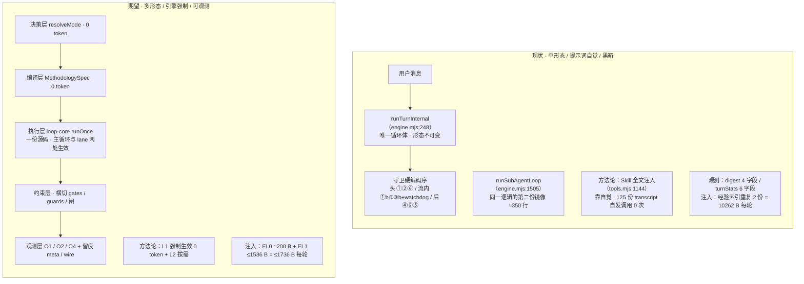
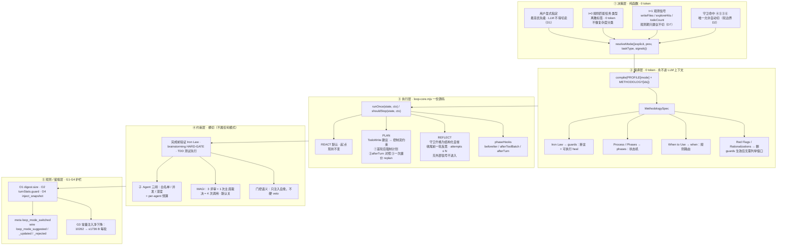
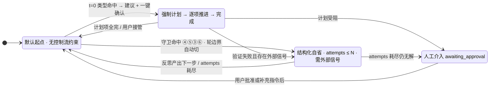
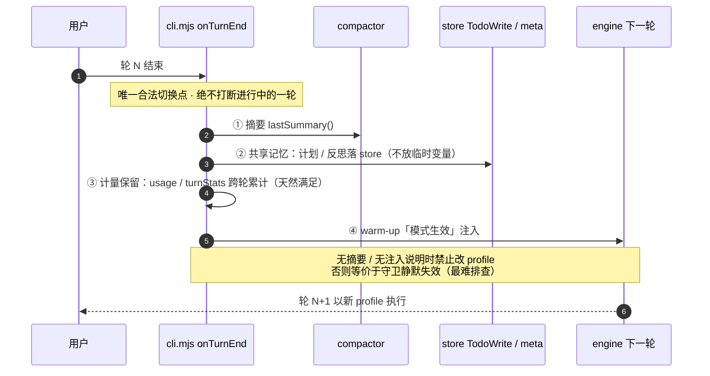
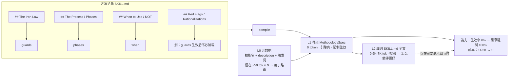
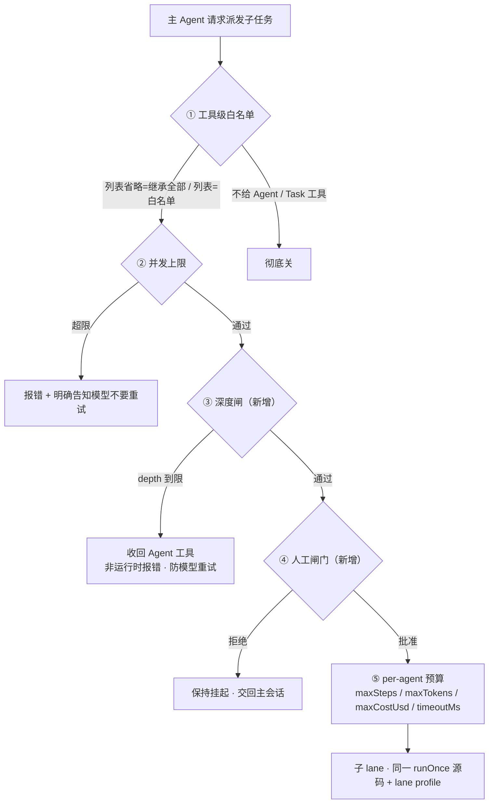
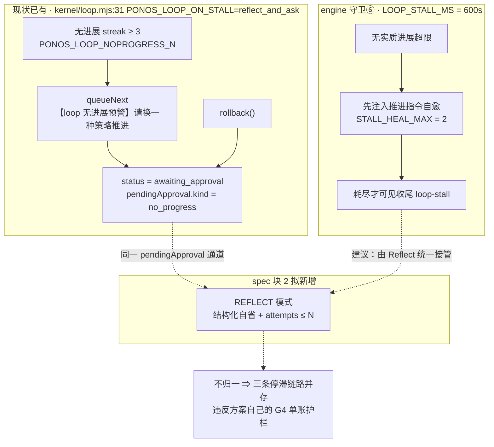
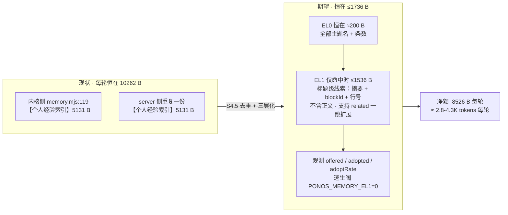

# Loop 模式自适应方案 · 客观收益评估 + 期望形态图

> 日期：2026-09-20
> 被评对象：`docs/superpowers/specs/2026-09-20-loop-mode-adaptive-design.md`（v2/v3）
> 关联增量：`docs/superpowers/specs/2026-09-20-injection-layer-unification-design.md`
> 评估方式：以代码事实为准（逐处核实）+ 区分"无条件收益 / 条件性收益 / 实验性收益"

---

## 0. 结论先行

**这是一份少见的高质量设计**：论证方式（§2.0 四判据替代"无先例"否决）、自我修正（§3.2 主动下调收益预期）、明确不做（§13 含技术理由）、护栏（G1–G4 零和预算）都做得扎实。

但从**客观收益**看，方案里三件事被混在一起，价值量级差异极大：

| 归类 | 内容 | 判断 |
|---|---|---|
| **无条件正收益、低风险** | 观测层 O1/O2/O3（§7）、经验注入去重（S4.5）、注入总账 O4（S1+） | 应**独立先行**，不绑其他步 |
| **真实缺口补齐** | 子 Agent 深度闸 / per-agent 预算（二期 S13/S15） | 审计 12.1-5 已确认无上限 ⇒ 补了就是净赚 |
| **先付费的工程健康** | B1 循环体契约（纯重构） | 收益真实但需先承担高风险等价搬移 |
| **产品级差异（最值钱，但被"省 token"叙事掩盖）** | 方法论从"提示词自觉"下沉为"引擎强制"（§9） | **真正的价值不是省钱，是把"不发生"变成"必定发生"** |
| **实验性、可能为负** | Plan/Reflect 模式切换、MAGI | 文献与本地实测均显示条件性；默认关是对的 |

**最大风险不在单项技术，而在收敛性**：一期 S1–S12 共 **16 步**，跨 `kernel/` + `server/` + `src/` + 注入层，新增 4 个内核模块（`loop-core.mjs` / `loop-mode.mjs` / `methodology.mjs` / `inject-bus.mjs`），且把"零行为变更的重构"（B1）与"行为变更"（B2）压在同一期交付。

---

## 1. 收益逐项量化（核实后口径）

### 1.1 无条件正收益（不依赖其他步兑现）

| 项 | 口径 | 量级 | 证据 |
|---|---|---|---|
| **经验注入去重** | system 中经验相关内容出现 **2 次** → 1；5131 B × 2 = 10262 B → EL0 ~200 B + EL1 ≤1536 B | **−8526 B/轮**（恒在，每轮都省） | 增量 spec §「每轮恒在合计 10262 → ≤1736」；内核侧来源 `memory.mjs:119` |
| **观测层 O1** | `turnToolDigest` 补 `size`（整数长度，不复制正文） | 0 token、0 体积风险 | `engine.mjs:1026` 原始 `content` 已读，`:1031-1035` 未取 ⇒ 事实成立 |
| **观测层 O2** | `turnStats` 补 `guard:{type,attempt,heal}` | 0 token（仅落盘） | `engine.mjs:2386` 现仅 6 字段 ⇒ 事实成立 |
| **观测层 O3** | `appendMeta('loop_mode_switched'\|'methodology_applied')` | 0 token | `cli.mjs:1550-1570` 已有"热切+校验+meta+wire"四件套范式可照抄 |

**换算**：8526 B 中文约 **2.8K–4.3K tokens/轮**。按 50 轮会话 ≈ 140K–215K input tokens。**金额上很小**（0.2 元/M ≈ 0.03–0.04 元/会话），但**每轮腾出的窗口占用是实打实的**——这是"能多放干货"的收益，不是"省钱"的收益。评估时不应按省钱口径宣传。

### 1.2 ⚠️ 需要修正的一处收益口径（§9.8）

spec §9.8 写「首批合计节省：约 **11–13K tokens/任务**」。这个口径**高估**，因为它隐含假设"任务本来就会加载这些 SKILL.md"。

仓库自己的实证否定了这个前提（`prompt.mjs:201-205` 注释原文）：

> 125 份 transcript：98.7% 的复杂会话直接 Read/Bash 开场，**Skill 自发调用 0 次**

⇒ 真实期望收益 = `P(加载技能) × 14.5K`，而当前 `P ≈ 0`（除用户手打技能名）。

**但这恰恰把价值说得更清楚了**——下沉的真实价值不是"省 14.5K"，而是：

> 方法论**从"概率≈0 会发生"变成"引擎强制必定发生"**，而成本**同时从 14.5K 降到 0**。

这是**唯一同时改善"能力"和"成本"的改动**，比省钱值钱得多。建议 spec 把 §9.8 的叙事从"省 token"改为"生效率 0% → 强制 100%，且成本归零"。

### 1.3 真实缺口补齐（审计已确认，非本设计新发现）

| 缺口 | 现状证据 | 补齐动作 |
|---|---|---|
| 无深度闸 | `engine.mjs:2013` `depth` 只入血缘（注释标 S4 预留），无上限检查 | 块 3 ③；到限**收回工具**而非报错（避免模型重试） |
| 无 per-agent 步数/token/成本上限 | 审计 12.1-5 | 块 3 ⑤；`agents.mjs` frontmatter |
| 无"派发前人工批准" | `approval-mode.mjs` 的 `agent:'loose'` 是工具级放行，非每次派发问一次 | 块 3 ④；复用 `loop.mjs` 既有 `awaiting_approval` |
| 失败模式未进测量面 | 审计 13.1-1（G1） | O2 |

### 1.4 先付费的工程健康（B1）

- 可共享真重复：**约 300–350 行**（守卫检查组 / 自愈注入 / 流式聚合 / 停流判定 / usage 累加）
- 刻意不同**不该收敛**：约 250 行（lane 无 health / 无锚点 / 无完整 `preStep`；`inbox`(B2) vs `pendingNext`(P8)；`guardStop`(return) vs `loopStop`+`break`）
- 核实：`engine.mjs:248 runTurnInternal` 与 `:1505 runSubAgentLoop` 确为两套镜像；`:1502-1504` 注释明写"无健康（短会话）；无压缩器"⇒ spec §3.2 的修正准确

**收益** = 消除双写漂移（改一处忘另一处的隐患）。**代价** = 对 2436 行文件核心函数做等价搬移 + 三重回归锁。**结论：值得做，但必须独立交付、独立回滚**（spec §6.4 已这么说，§12.1 却与 B2 同压一期——矛盾）。

### 1.5 实验性收益（不该计入承诺）

| 项 | 为什么不能计入 |
|---|---|
| Reflect 模式 | spec §13 自引 TACL 2024 / ICLR 2024 / arXiv 2310.12397：**无外部真值信号时自省不成立、可能变差**。设硬约束（无 `doneWhen`/无失败证据不进入）是对的，但收益仍属待验 |
| Plan 模式 | 默认不设 Plan 是正确取舍；复杂任务有收益，误判则"简单任务背计划开销" |
| MAGI | 本地 n=3 实测异族 81% < 现状 100%；4 次调用预算 + 默认关 + 单次主席裁决（非平均、非辩论）——规避到位，但仍属"可选能力"，不改变默认体验 |
| t=1 阈值 | D7 先观测后定，S12 之前**收益为 0**（OBSERVE_ONLY 只落账不切换）。这是正确做法，但也就意味着**一期前半段用户感知不到模式收益** |

### 1.6 一处需要补充核实的既有能力（避免重复造轮子）

`kernel/loop.mjs` **已经存在**一条与"Reflect 模式 + 人工闸门"高度重叠的链路，且默认开启：

```js
const onStall = String(env.PONOS_LOOP_ON_STALL || 'reflect_and_ask')   // loop.mjs:31
// 无进展 streak ≥ 3（PONOS_LOOP_NOPROGRESS_N）→
//   engine.queueNext('【loop 无进展预警】…请换一种策略推进…')
//   status = 'awaiting_approval'，pendingApproval = {kind:'no_progress'}
```
（另含 `rollback()` 也走同一 `pendingApproval` 通道）

**含义有两层**：
1. ✅ **正面**：这是 spec「模式 = 既有构件重组合」论点的又一铁证——Reflect 的一半（停滞→结构化反思注入→挂起等人工介入）**已经在生产里跑**，块 2 的 Reflect 更像是把这条既有链路"模式化 + 补齐轮边界切换"。
2. ⚠️ **风险**：spec §8 与块 3 都写"复用 `awaiting_approval`"，但**未点名 loop.mjs 已有实现**。若不先盘点，极易出现**第二条停滞→反思链路**（engine 守卫⑥ 一套、loop 控制器一套、新 Reflect 模式第三套）——正是 G4「单账」护栏要防的事。建议 §8/§14.1 显式声明**三者归一的方案**（谁在什么条件下触发、如何互斥）。

---

## 2. 成本与风险（客观清单）

| # | 风险 | 等级 | 客观依据 | 缓解是否足够 |
|---|---|---|---|---|
| R1 | B1 等价搬移触碰 2436 行核心函数 | **高** | 守卫序三段（`:486/:495/:497`、`:620/:630/:643`、`:932/:1066/:1076/:1083`）全部路径都要过 | 三重锁 L1/L2/L3 够用；**但需独立交付** |
| R2 | 一期改动面 16 步跨 4 层 | **高** | 新增 4 个内核模块 + server 侧断言更新（`server/experience.test.mjs`、`prompt-skills.test.mjs`）+ GUI 3 处 | spec §17 未做**收敛性**论证；建议切香肠 |
| R3 | 方法论判据误伤正常流程 | 中高 | 命中即注入自愈文本，用户感知为"AI 反复自我怀疑" | 宁漏勿滥 + 误伤对照 + `PONOS_METHODOLOGY=off`；**够用** |
| R4 | 三条"停滞→反思"链路并存 | 中高 | 见 §1.6 | **未识别，需补** |
| R5 | lean 会话无 Plan 提示词基础 | 中高 | 已核实为真：`prompt.mjs` lean 版 `changeFocus` 仅 3 条（最小改动/收敛/禁 Bash），**无"复杂任务先规划"**（该行仅在非 lean 分支） | spec §15 已识别并要求 `modeDirective('plan')` 自带注入；**判断准确** |
| R6 | 方法论 spec 与 SKILL.md 双源漂移 | 中 | 阶段一手写 + SKILL.md 并存 | `sourceVersion` + CI 漂移检查；够用 |
| R7 | 模式徽标/建议卡增加 UI 复杂度 | 低中 | 用户关心结果不关心模式 | 照 `SessionModeBar` 范式，可接受 |
| R8 | 每次 replan 判定增成本 | 中 | Plan 模式 +1 次/轮 | 需观测期测收益/成本比 |
| R9 | `errors`/`size` 等新字段进 `turnToolDigest` 影响既有消费者 | 低 | `loop.mjs:fingerprintOf` 用 `name/path/isError/errorText`；新增字段不破坏 | 纯增量，安全 |

**风险合计判断**：单项风险都有缓解，**风险主要来自"同时做太多"**。spec §15 的风险表覆盖了 R1/R3/R5/R6/R8，**漏了 R2（收敛性）与 R4（三链路并存）**。

---

## 3. 净判断与建议

### 3.1 该方案值得做，但要改变交付节奏

**理由**：它解决的是三个**结构性**问题，而不是补丁：
1. 方法论**靠自觉**（代价：0 生效率 + 20.6K tokens 常驻）→ 靠引擎强制（生效率 100%，成本 0）
2. 复杂度/失败模式**在黑箱里**（代价：阈值只能拍脑袋）→ 进测量面
3. 守卫逻辑**两处镜像**（代价：改一处忘另一处）→ 一份源码

### 3.2 建议的切分（三批，而非一期/二期）

| 批 | 内容 | 为什么先做 | 依赖 |
|---|---|---|---|
| **批 1（无条件正收益）** | S1 + S1+（观测层 + 注入总账）+ S4.5（经验去重三层化） | 纯增量 / 纯删减，零行为变更；8526 B/轮 立即可测；**不依赖 B1** | 无 |
| **批 2（重构冻结）** | B1：S2 + S3 + S3.5，**独立交付、独立回滚** | 零行为变更，是 B2 的地基；不应与行为变更混在同一期验收 | 批 1 的 O2 用于验证等价性 |
| **批 3（能力试点）** | S5 单点（`verification-before-completion` 一个判据 + 误伤对照）→ 数据达标后才 S6–S11 | 先用**最小样本**验判据准确率；不达标则止损，成本仅一步 | 批 2 |
| **批 4（二期原样）** | 块 3（深度闸/per-agent 预算）+ 块 4（MAGI） | 真实缺口，默认关，风险隔离 | 独立 |

**核心建议**：**S12（观测期定阈值）不该是一期的最后一步，而应是贯穿全程的并行轨道**——OBSERVE_ONLY 一期全开，数据边收边定，否则 S8/S9 的 Plan/Reflect 判据在无数据时无法验收。

### 3.3 两处必补

1. **§8/§14.1 补"三条停滞→反思链路归一"**（见 §1.6 R4）——否则违反自己的 G4「单账」护栏。
2. **§9.8 收益叙事改为"生效率 0%→100% 且成本归零"**，不按"省 11–13K/任务"宣传（见 §1.2）。

---

## 4. 期望实现的 loop 形态（图）

### 图 A —— 形态对照：现状 vs 期望

```
━━━━━━━━━━━━━ 现状（单形态 / 提示词自觉 / 黑箱） ━━━━━━━━━━━━━

  用户消息
      │
      ▼
  runTurnInternal（engine.mjs:248）  ← 唯一循环体，形态不可变
      ├─ 迭代 1..N ──────────────────────────────────────┐
      │    模型 → 工具 → 结果 → 模型 …（ReAct，硬编码）    │
      │    守卫固定序：头①②⑥ 流内①b③③b+watchdog 后④⑥⑤ │
      └───────────────────────────────────────────────────┘
      │
      ▼  收尾（loopStop / guardStop）
  runSubAgentLoop（engine.mjs:1505）← 同一套逻辑的**第二份镜像**（约 350 行）

  方法论：Skill 工具把 SKILL.md **全文**注入上下文（tools.mjs:1144）
          → 靠模型自觉遵守（实测：125 份 transcript 自发调用 0 次）
  模式：  「模式」概念不存在，无法选、无法切
  观测：  turnToolDigest 4 字段（无 size）/ turnStats 6 字段（无 guard）
  注入：  经验索引 **2 份重复**（10262 B/轮，恒在）


━━━━━━━━━━━━━ 期望（多形态 / 引擎强制 / 可观测） ━━━━━━━━━━━━━

┌────────────────────── ① 决策层（纯函数，0 token） ──────────────────────┐
│                                                                        │
│   用户显式指定 ───────────► 优先级最高，LLM 不得切走（D1）              │
│   t=0 规则匹配 ───────────► 任务**类型**（离散标签）→ 建议方法论        │
│                              ✗ 不做复杂度分类（连续量，t=0 信息不足）    │
│   t=1 观测信号 ───────────► writeFiles / exploreHits / todoCount        │
│                             （先观测期，只建议不切 —— D7）              │
│   守卫命中 ④⑤③⑥ ────────► **唯一允许自动切**的入口（轮边界，D2）        │
│                                                                        │
│   输出：resolveMode({explicit, prev, taskType, signals}) → mode         │
└────────────────────────────────┬───────────────────────────────────────┘
                                 │  compile(PROFILE[mode] + METHODOLOGY[ids])
┌────────────────────────────────▼────── ② 编译层（0 token，不进上下文）──┐
│                                                                        │
│   SKILL.md 骨架的四段结构 ──编译──► MethodologySpec                     │
│                                                                        │
│     ## The Iron Law / 核心 ──────► guards   断言 + **可执行 heal 文案** │
│     ## The Process / N Phases ───► phases   状态机（RED→GREEN→…）      │
│     ## When to Use / NOT ────────► when     规则路由（0 token）        │
│     ## Red Flags / Rationaliz. ──► **删**   guards 生效后无需列举借口   │
│                                                                        │
│   首批（S5–S11）：verify-before-claim / 技能路由 / subagent-driven /   │
│                   brainstorming HARD-GATE / systematic-debugging       │
└────────────────────────────────┬───────────────────────────────────────┘
                                 │
┌────────────────────────────────▼────── ③ 执行层（B1：唯一循环体）──────┐
│                                                                        │
│   loop-core.mjs   runOnce(state, ctx) / shouldStop(state, ctx)         │
│                   ↑ 一份源码，主循环与 lane 两处生效（不再镜像）        │
│                                                                        │
│   ┌─ REACT ────┐   ┌─ PLAN ──────────────┐   ┌─ REFLECT ────────────┐  │
│   │ 现状不变    │   │ TodoWrite 从建议     │   │ 守卫升格为结构化自省  │  │
│   │            │   │  升级为控制流约束     │   │                      │  │
│   │ 起点默认    │   │ ①首轮后强制计划      │   │ 强制收尾前一轮反思    │  │
│   │            │   │ ②afterTurn 对照计划  │   │ attempts ≤ N         │  │
│   │            │   │ ③一次廉价 replan     │   │ ⚠硬约束：无外部信号   │  │
│   │            │   │ 计划表示 = TodoWrite │   │   不进入（文献已证）  │  │
│   └────────────┘   └──────────────────────┘   └──────────────────────┘  │
│                                                                        │
│   LoopProfile 参数化面：guards 三段序 / thresholds / compactor /        │
│                         health / inject / stop / **phaseHooks**        │
│   phaseHooks = beforeIter · afterToolBatch · afterTurn ← 模式挂载点     │
└────────────────────────────────┬───────────────────────────────────────┘
                                 │
┌────────────────────────────────▼──── ④ 约束层（横切，不属任何模式）────┐
│   完成前验证 Iron Law（全模式）     ┃  设计未批准不得实现 HARD-GATE     │
│   TDD 测试先行（按任务类型启用）    ┃  子 Agent 三闸：白名单/并发/深度  │
│   并发派发纪律                      ┃  per-agent 预算 steps/tokens/超时│
│   审查请求/接收（块 4）             ┃  MAGI 三评审 + 单次主席裁决 = 4 次│
│   门控语义：只**注入自愈**，不硬 veto（与既有守卫家族一致）             │
└────────────────────────────────┬───────────────────────────────────────┘
                                 │
┌────────────────────────────────▼──── ⑤ 观测 / 留痕层（G1–G4 护栏）────┐
│   O1 turnToolDigest.size   O2 turnStats.guard   O4 inject_snapshot     │
│   meta : loop_mode_switched | methodology_applied                      │
│   wire : loop_mode_suggested | _updated | _rejected                    │
│   ────────────────────────────────────────────────────────────────     │
│   G1 零和预算（新通道须从存量抽让渡）  G2 通道数不增                    │
│   G3 常量注入净下降（10262 → ≤1736 B） G4 单账（同一事实一处采集）      │
└────────────────────────────────────────────────────────────────────────┘
```

### 图 B —— 轮边界切换协议（"不裸切"四步 + 何时能切）

```
   一次"轮"的生命周期（切换**只**发生在轮边界，绝不打断进行中的一轮）

   ┌── 轮 N ────────────────────────────────────────────────────────┐
   │  beforeIter ─► [迭代1: 模型→工具] ─► [迭代2] ─► … ─► 收尾      │
   │       ▲                ▲                                        │
   │       │                └─ phaseHooks.afterToolBatch（模式介入点）│
   │       └─ phaseHooks.beforeIter（模式介入点）                    │
   └──────────────────────────────┬─────────────────────────────────┘
                                  │
                    cli.mjs:1322 loop.onTurnEnd  ← 唯一合法切换点
                                  │
        ┌─────────────────────────▼─────────────────────────┐
        │  ① 摘要：compactor.lastSummary() 注入请求面尾部    │  ← 复用既有
        │  ② 共享记忆：计划/反思落 store（TodoWrite / meta） │  ← 不放临时变量
        │  ③ 计量保留：usage / turnStats 跨轮累计（天然满足）│
        │  ④ warm-up：插入"模式生效"说明，**切了要说**       │
        └─────────────────────────┬─────────────────────────┘
                                  │
        ★ 不裸切的硬要求：无摘要 / 无注入说明时**禁止**改 profile
          （否则等价于"守卫静默失效"，最难排查的 bug 类型）

   切换权限矩阵：
     来源 \ 能否自动切          自动切  需用户一键确认
     ────────────────────────────────────────────────────
     用户显式指定               —      即生效（最高优先级）
     t=0 规则匹配 / skill 命中   ✗      ✔（Cursor 形态，0 额外成本）
     t=1 观测信号命中阈值        ✗      ✔（不静默切）
     守卫命中 ④⑤③⑥             ✔      —（唯一允许自动切）
     用户指定后 LLM 想切走        ✗      ✗（D1 禁止）

   切换时必须保留（防"切模式=重置守卫预算"被反复利用）：
     守卫计数器 ✔保留   attemptMaxTokens ✔保留
     未完成计划 ✔保留+注入"计划仍在，请继续"
     自动切换频率：每轮至多一次（防模式抖动）
```

### 图 C —— 方法论三层加载（省 token 的机制 + 能力不降级的机制）

```
   ┌── L0 元数据 ── 恒在，~50 tokens × N ──────────────────────────┐
   │  技能名 + description + 触发词（已在 prompt.mjs 的【可用技能】）│
   │  用途：**路由**（决定该用哪个方法论）                          │
   └────────────────────────────────────────────────────────────────┘
   ┌── L1 骨架 ──── 0 tokens（引擎内，永不进 LLM 上下文）──────────┐
   │  MethodologySpec：when / phases / gates / guards / budget      │
   │  用途：**流程不走偏**（引擎强制，与模型能力无关）               │
   │  ⇒ 这是收益的核心：能力从"概率≈0 生效"变成"必定生效"           │
   └────────────────────────────────────────────────────────────────┘
   ┌── L2 细则 ──── 按需，0.6K–7K tokens ──────────────────────────┐
   │  SKILL.md 全文（Skill 工具仍可加载）                            │
   │  用途：**怎么做得更好**（语义指导：如"计划粒度怎么切"）         │
   │  触发：仅在需要语义细节时                                      │
   └────────────────────────────────────────────────────────────────┘

   对照：现状 = 每次都付 L2（14.5K/任务），却拿不到 L1（无强制，0 生效率）
         期望 = 常态 0 tokens 且 L1 强制生效；只在需要时买 L2
```

### 图 D —— 子 Agent 五闸（块 3，正交）

```
   主 Agent
      │  想派子 Agent
      ▼
   ┌①工具级白名单──┐ 不给 Agent/Task 工具 = 彻底关（复用 CHAT_MODE_DISALLOWED 同构）
   │               │ 通过
   ▼               │
   ┌②并发上限──────┐ 前台+后台**共用**同一预算；超限报错并明确"不要重试"
   │               │ 通过
   ▼               │
   ┌③深度闸(新)────┐ depth 到限 → **收回 Agent 工具**（非运行时报错，防模型重试）
   │               │ 通过
   ▼               │
   ┌④人工闸门(新)──┐ 暂停-恢复：派发前挂起 → 主会话批/拒（复用 awaiting_approval）
   │               │ 批准
   ▼               │
   ┌⑤per-agent预算─┐ maxSteps / maxTokens / maxCostUsd / timeoutMs（frontmatter）
   └───────┬───────┘
           ▼
      子 lane 运行（同一 runOnce 源码，传 lane profile）
```

### 图 E —— 一条经验注入的形态变化（S4.5，最确定的一笔收益）

```
   现状：每轮恒在
   ┌─────────────────────────────────────────────────────────────┐
   │ system: 【个人经验索引】…（内核侧 memory.mjs:119） 5131 B    │
   │ system: 【个人经验索引】…（server 侧重复一份）     5131 B    │
   │                                         合计 10262 B/轮  ✗  │
   └─────────────────────────────────────────────────────────────┘

   期望：恒在极薄 + 命中才发线索（只发索引线索，**不含正文**）
   ┌─────────────────────────────────────────────────────────────┐
   │ EL0（恒在，~200 B）                                          │
   │   全部**主题名 + 条数**（让模型知道"有哪些主题"）              │
   │                                                             │
   │ EL1（**仅命中时**，≤1536 B）                                 │
   │   「标题级线索」= 摘要 + blockId + 文件行号                   │
   │   ✗ 不含 ` ·全文` 正文；agent 需正文时自行 Read               │
   │   ✔ 支持 related 一跳扩展线索阅读                            │
   │   观测：offered / adopted / adoptRate（采纳率可测）           │
   │   逃生阀：PONOS_MEMORY_EL1=0                                 │
   │                                         合计 ≤1736 B/轮  ✔   │
   └─────────────────────────────────────────────────────────────┘
   ⇒ −8526 B/轮，且与既定约束"不复制结果正文（体积与隐私）"相容
     （线索不含正文、总账走 appendMeta 不进上下文）
```

---

## 5. 一句话总评

> 方案的**技术判断大多是对的**（拒绝复杂度分类器、拒绝无信号自省、拒绝辩论与平均、拒绝异族模型、拒绝清零守卫计数），**护栏也自洽**（G1 零和预算 / G4 单账）。
> 真正的问题**不是设计方向，而是交付节奏**：把"零行为变更的重构（B1）"与"多处行为变更（B2/块5）"压在同期，叠加 16 步跨四层改动，**收敛性风险高于任一单项技术风险**。
> 建议：**批 1（观测 + 经验去重）即刻独立落地**（无条件正收益、零行为变更）；**B1 独立交付并冻结**；**方法论下沉先做 1 个判据试点**，用数据决定是否铺开。

---

## 6. Mermaid 形态图（可直接渲染）

### 图 M1 —— 现状 vs 期望（形态对照）



### 图 M2 —— 期望 loop 形态（五层主图）



### 图 M3 —— 模式状态机与切换权限



### 图 M4 —— 轮边界切换协议（不裸切四步）



### 图 M5 —— 方法论编译与三层加载（收益机制）



### 图 M6 —— 子 Agent 五闸（块 3）



### 图 M7 —— 停滞→反思链路：现状已有 vs 拟新增（R4 风险图）

> 这张图对应 §1.6 / §3.3 必补项 1：spec 未识别 `loop.mjs` 已有的 `reflect_and_ask` 链路与拟新增 Reflect 模式的重叠。



### 图 M8 —— 经验注入的形态变化（S4.5，最确定的一笔收益）



---

## 7. 综合收益显著性研判

### 7.1 先分离三个口径（"显著"相对什么）

| 口径 | 含义 | 结论 |
|---|---|---|
| **用户可感（更快/更省/更强）** | 用户能直接察觉的改善 | **不显著**（见 7.2） |
| **工程可治理性** | 系统从"不可知"变"可测量"、从"双写"变"单份" | **显著** |
| **可能性边界（option value）** | 不产生当期收益，但决定后续优化是否可能 | **显著**，但属"必要"而非"收益" |

### 7.2 支出与性能：金额收益接近零，且被新增调用抵消

**关键事实：省下的 tokens 落在 system prompt 前部 = 前缀缓存命中区，按 `cacheReadRatio = 0.1` 计价**（`cost.mjs:10-13`；单价来源 `PONOS_PRICE_PER_M_INPUT` 默认 0.2 元/M）。

| 项 | 计算 | 量级（50 轮会话） |
|---|---|---|
| 经验去重节省 | −8526 B/轮 ≈ 2842 汉字 ≈ 2.8K tokens（中文 3 B/字，保守） | — |
| ↳ 缓存命中计价 | 2.8K × 0.2元/M × 0.1 | **≈ 0.003 元** |
| ↳ 未命中计价（悲观） | 2.8K × 0.2元/M | ≈ 0.03 元 |
| Plan 模式 +1 次判定/轮 | 输出约 500 tokens × 1.2 元/M（输出无缓存折扣） | **≈ 0.03 元** |
| Reflect 模式 +2 次/轮 | 同上 ×2 | ≈ 0.06 元 |

⇒ **一次/轮的判定调用开销（≈0.03 元）与经验去重的全部金额收益（0.003–0.03 元）同数量级**——即新增判定本身就吃掉了省 token 的钱。

**性能（时延）方向为负**：每次额外 LLM 调用增加 1 个 RTT（数秒）。Plan +1/轮、Reflect +2/轮、MAGI +4 次（单次任务）。

**一处可补的优化**：若把 replan 判定**硬约束为"廉价模型 + 短上下文"**（spec 只说"一次廉价 replan"，未写成硬约束），成本与 RTT 都能压到可忽略。建议进 §14.1 验收。

### 7.3 能力：唯一有望"显著"的项，但尚未验证

**方法论下沉是方案里唯一同时改善能力与成本的机制**：

| 维度 | 现状 | 下沉后 |
|---|---|---|
| 生效概率 | ≈0（`prompt.mjs:201-205`：125 份 transcript，自发调用 0 次） | 引擎强制 → 100% |
| 成本 | 14.5K tokens/任务（**假设会加载**，实际 P≈0 ⇒ 期望收益≈0） | L1 = 0 tokens |

但必须严谨：**P≈0 意味着这条路径"从未真正工作过"** ⇒ 这是"从无到有"，不是"0.7→0.9"。**没有基线可对比，改善幅度完全取决于"强制生效后产出质量是否真的变好"，而这不在本方案的验收项里**（A9 只验"无 SKILL.md 时守卫仍生效"，不验"产出质量提升"）。

⇒ 判定：**潜在显著，当前不可判**。要判需要补一个质量指标（返工率 / 测试通过率 / 用户打回率）。

### 7.4 可治理性：这一维确实显著

| 变化 | 性质 |
|---|---|
| O1/O2/O3/O4：黑箱 → 可测量 | 改变的是**决策能力**；没有它，S12 阈值永远只能拍脑袋 |
| 方法论：提示词自觉 → 引擎强制 | 改变的是**可靠性的归因对象**（从"模型愿不愿意"变成"引擎是否强制"） |
| 守卫逻辑：两份镜像 → 一份源码 | 消除"改一处忘另一处"的隐患 |
| 三闸 + per-agent 预算 | 补齐审计 12.1-5 确认的**真实缺口**（当前无上限） |

### 7.5 ⚠️ 一处口径错位（会让"显著"被判错）

A11 的判据是「**同类任务的平均上下文 tokens** 可对比，且不明显反弹」——测的是 **tokens**，不是 **钱**。

而 §7.2 显示：tokens 下降 ≈ 2.8K/轮（**可测、会通过 A11**），但**金额收益被缓存折扣压到 ≈0**。

⇒ **A11 通过 ≠ 支出显著下降**。若对外按"降低成本"叙事，验收时会自相矛盾。建议 §14.1 拆成两条：A11a「上下文 tokens 下降」（现状口径，可达）+ A11b「金额成本下降 ≥X%」（**大概率不可达，应明说不设此目标**）。

### 7.6 最终研判

> **不能判为"显著"。准确表述是：工程上必要，收益上条件性，用户可感层面尚不显著。**

| 维度 | 评级 | 依据 |
|---|---|---|
| 支出（金额） | ★☆☆☆☆ | ≈0（缓存折扣 + 新增判定抵消） |
| 支出（窗口占用） | ★★★☆☆ | −8526 B/轮，真实但换算成金额极小；价值在"能多放干货" |
| 性能（时延） | ★★☆☆☆ | 方向为负（每轮 +1 次 RTT），需靠"廉价判定"约束收敛 |
| 能力（方法论） | ★★★☆☆ | 潜在显著但**未验证**（无质量基线） |
| 可治理性 | ★★★★★ | 真实、结构性的显著提升 |
| 风险 | — | 收敛性风险 > 任一单项技术风险（16 步跨四层 + B1/B2 同期） |

**唯一能把它从"不显著"推到"显著"的杠杆**：把"下沉"收益从"省 token"改成"**产出质量**"（返工率/一次通过率）——那才是量级对得上的地方（避免一次返工 = 省整轮甚至多轮，远大于 2.8K tokens）。

**否则，这个方案的真实定位是：为后续显著收益铺路的"基础设施"——它本身不显著，但没有它，后面任何优化都无法验证是否有效。**


